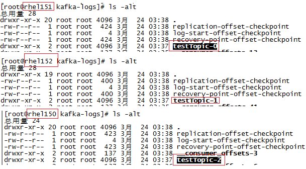

# ***Kafka主题分区
  今天来说一下Kafka主题的分区概念。背景：我们使用192.168.32.150~152共三台机器组建了kafka集群。

## 1，主题partition日志说明
  关于Kafka主题有两张官网的图示说明。
  下面这张图是关于kafka分区的，一个topic消息会有多个partition分布在不同的主机之上，每个partition下的消息单独编号(offset)
  
  
  
  另一张图说明主题下的消息，不同的消费者使用offset定位，以知晓自己消费的消息位置。
  
  

  在创建主题时:./kafka-topics.sh  --create有两个参数可是设置，一是"--partitions"主要说明一个主题分几个分区，另一个是"--replication-factor"为复制因子，指明partition的复制备份数。
  
  单台消息能保存的消息是有限度的，而采用partition可以扩展的方式支持海量消息的保存，另一个也能做到单个主题消息生产和消费时的负载均衡问题。而复制因子则主要是消息的容错性，对于单个partition会有一个所谓leader的角色负责消息读和取，多个follower负责备份消息，当leader宕机时有follower接管消息处理。
## 2，验证性测试
### 2.1， 创建主题
  当我们采用如下命令创建一个testTopic主题，分区数设置为3，复制因为设置为1
  kafka-topics.sh --create --zookeeper $zk_options --replication-factor 1 --partitions 3 --topic testTopic
  
  如下图所示，查看kafka三台主机上的kafka-logs目录，会看到这三个partition的目录被创建了。
  

### 2.2，发送消息
启动一个kafka生产者，直接发送三条消息，如下文本分别为6个1、6个2、6个3

```
[root@rhel150 ~]# ./kafka/kafka_2.11-2.1.0/bin/kafka-console-producer.sh --broker-list 192.168.32.150:9092,192.168.32.151:9092,192.168.32.152:9092 --topic testTopic
>111111
>222222
>333333
>
```
分别在每个kafka机器broker目录查看kafka-logs目录下的partition日志文件可以看到消息确实是均分到不同的机器保存的。

150机器：
```
[root@rhel150 kafka_2.11-2.1.0]# cat kafka-logs/testTopic-2/00000000000000000002.log 
>?Vr\i?R￡?i?R￡ο
            111111
```
151机器：
```
[root@rhel151 testTopic-0]# cat kafka-logs/testTopic-0/00000000000000000002.log 
>?i?R′i?R′
             333333
```
152机器：
```
[root@rhel152 testTopic-1]# cat kafka-logs/testTopic-1/00000000000000000002.log 
>?i?R′i?R′
             222222
```
### 2.3，消息处理
启动一个consumer，指定"--from-beginning"从头接收消息，就可以接受前面所有的消息。

```
[root@rhel150 bin]# ./kafka-console-consumer.sh --bootstrap-server 192.168.32.150:9092,192.168.32.151:9092,192.168.32.152:9092 --from-beginning --topic testTopic
333333
222222
111111
```

如果消息消息的时候指定了--partition参数，则只能消费固定partition消息，如下的consumer就只能消费partition 1的消息(222222：这条消息可以参见上面就是对应152机器上的partition)。
```
[root@rhel152 bin]# ./kafka-console-consumer.sh --bootstrap-server 192.168.32.150:9092,192.168.32.151:9092,192.168.32.152:9092 --from-beginning --partition 1 --topic testTopic
222222
```
