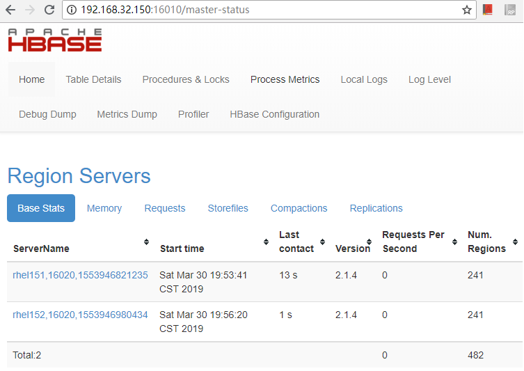

# ***HBase
  HBase是Hadoop生态圈分布式大数据存储数据库，按照官方宣称的目标：HBase的目标是托管非常大的数据表，表规模为成千上万列数，上亿级别的行数。如同BigTable使用谷歌GFS文件系统一样，HBase使用Hadoop和HDFS作为底层存储。
  
  以下给予HBase2.1.4版本进行入门说明，同样使用192.168.32.150~152三台机器组建HBase集群。32.150作为master，32.151和32.152作为regionserver。

## 1，安装说明
### 1.1,安装前准备
  **JDK准备**：HBase 1.x版本需要JDK1.7版本以上，而HBase 2.x版本则需要JDK1.8版本以上，因此需要在主机安装合适的JDK版本。
  
  **ZooKeeper准备**：hbase启动时可以启动内置的ZooKeeper，但我们也可以事先安装和启动ZooKeeper，让HBase使用我们已有的ZooKeeper。2.1.4版本需要Zookeeper版本为3.4.x。
  
  **HDFS**：在集群验证中，我们采用HDFS作为底层存储。 当然，也可以使用本地文件系统。
  
  从官网https://hbase.apache.org可以很容易进入下载链接。
  
  下载hbase-2.1.4-bin.tar.gz后直接对其进行解压，解压后的hbase-2.1.4即为HBase根目录，如下命令：
```
$ tar -zxvf hbase-2.1.4-bin.tar.gz
$ cd cd hbase-2.1.4/
```

## 2，配置
### 2.1，环境变量配置
  修改conf/hbase-env.sh文件，正确设置JDK路径。
  
  此外，HBASE_MANAGES_ZK默认只为true(也就是HBase启动时启动ZK)，因为事先启动了ZK，所以这里配置为false(使用外部已经启动的ZK)。
```
vi conf/hbase-env.sh 

# The java implementation to use.  Java 1.8+ required.
# export JAVA_HOME=/usr/java/jdk1.8.0/
export JAVA_HOME=/usr/java/jdk1.8.0_77

# Tell HBase whether it should manage it's own instance of ZooKeeper or not.
# export HBASE_MANAGES_ZK=true
export HBASE_MANAGES_ZK=false
```

### 2.2，主服务配置conf/hbase-site.xml
  如下，主要配置了HDFS的地址，还有ZK对应的主机和端口。
  并配置"hbase.cluster.distributed"为true，配置这个属性主要是在运行hbase启动的时候自动启动regionserver，而不是只启动master。
```
<configuration>
  <property>
    <name>hbase.rootdir</name>
    <value>hdfs://rhel150:9000/hbase</value>
  </property>

  <property>
    <name>hbase.tmp.dir</name>
    <value>/root/hbase-2.1.4/data/hbase/tmpdata</value>
  </property>

  <property>
      <name>hbase.cluster.distributed</name>
      <value>true</value>
  </property>


    <property>
        <name>hbase.zookeeper.property.clientPort</name>
        <value>2181</value>
    </property>
    <property>
        <name>hbase.zookeeper.quorum</name>
        <value>rhel150,rhel151,rhel152</value>
    </property>

</configuration>
```
### 2.3，启动
  在32.150(master)主机，运行bin/start-hbase.sh脚本以启动master和regionserver。
  首次启动可能出现如下错误，主要为htrace的jar包默认在hbase的lib目录没有，需要从hadoop1.x版本中找到htrace的3.x版本(比如htrace-core-3.1.0-incubating.jar)，注意不能是4.x版本。
```
2019-03-28 21:42:18,991 ERROR [main] regionserver.HRegionServer: Failed construction RegionServer
java.lang.NoClassDefFoundError: org/apache/htrace/SamplerBuilder
        at org.apache.hadoop.hdfs.DFSClient.<init>(DFSClient.java:644)
        at org.apache.hadoop.hdfs.DFSClient.<init>(DFSClient.java:628)
        at org.apache.hadoop.hdfs.DistributedFileSystem.initialize(DistributedFileSystem.java:149)
        at org.apache.hadoop.fs.FileSystem.createFileSystem(FileSystem.java:2667)
        at org.apache.hadoop.fs.FileSystem.access$200(FileSystem.java:93)
        at org.apache.hadoop.fs.FileSystem$Cache.getInternal(FileSystem.java:2701)
        at org.apache.hadoop.fs.FileSystem$Cache.get(FileSystem.java:2683)
        at org.apache.hadoop.fs.FileSystem.get(FileSystem.java:372)
        at org.apache.hadoop.fs.Path.getFileSystem(Path.java:295)
        at org.apache.hadoop.hbase.util.CommonFSUtils.getRootDir(CommonFSUtils.java:362)
        at org.apache.hadoop.hbase.util.CommonFSUtils.isValidWALRootDir(CommonFSUtils.java:411)
        at org.apache.hadoop.hbase.util.CommonFSUtils.getWALRootDir(CommonFSUtils.java:387)
        at org.apache.hadoop.hbase.regionserver.HRegionServer.initializeFileSystem(HRegionServer.java:704)
        at org.apache.hadoop.hbase.regionserver.HRegionServer.<init>(HRegionServer.java:613)
        at org.apache.hadoop.hbase.master.HMaster.<init>(HMaster.java:489)
        at sun.reflect.NativeConstructorAccessorImpl.newInstance0(Native Method)
        at sun.reflect.NativeConstructorAccessorImpl.newInstance(NativeConstructorAccessorImpl.java:62)
        at sun.reflect.DelegatingConstructorAccessorImpl.newInstance(DelegatingConstructorAccessorImpl.java:45)
        at java.lang.reflect.Constructor.newInstance(Constructor.java:423)
        at org.apache.hadoop.hbase.master.HMaster.constructMaster(HMaster.java:3093)
        at org.apache.hadoop.hbase.master.HMasterCommandLine.startMaster(HMasterCommandLine.java:236)
        at org.apache.hadoop.hbase.master.HMasterCommandLine.run(HMasterCommandLine.java:140)
        at org.apache.hadoop.util.ToolRunner.run(ToolRunner.java:70)
        at org.apache.hadoop.hbase.util.ServerCommandLine.doMain(ServerCommandLine.java:149)
        at org.apache.hadoop.hbase.master.HMaster.main(HMaster.java:3111)
Caused by: java.lang.ClassNotFoundException: org.apache.htrace.SamplerBuilder
        at java.net.URLClassLoader.findClass(URLClassLoader.java:381)
        at java.lang.ClassLoader.loadClass(ClassLoader.java:424)
        at sun.misc.Launcher$AppClassLoader.loadClass(Launcher.java:331)
        at java.lang.ClassLoader.loadClass(ClassLoader.java:357)
```

### 2.4,确认
启动成功后通过访问master主机的16010端口可以看到类如下图，显示所有的regionserver。



hbase shell测试，通过"hbase shell"进入hbase shell命令行。使用create和describe测试创建表和查看表信息。


```
hbase(main):004:0> create 'table1','fa1'
Created table table1
Took 1.4340 seconds                                                                                                  
=> Hbase::Table - table1

hbase(main):002:0> describe 'table1'
Table table1 is ENABLED                                                                                              
table1                                                                                                               
COLUMN FAMILIES DESCRIPTION                                                                                          
{NAME => 'fa1', VERSIONS => '1', EVICT_BLOCKS_ON_CLOSE => 'false', NEW_VERSION_BEHAVIOR => 'false', KEEP_DELETED_CELL
S => 'FALSE', CACHE_DATA_ON_WRITE => 'false', DATA_BLOCK_ENCODING => 'NONE', TTL => 'FOREVER', MIN_VERSIONS => '0', R
EPLICATION_SCOPE => '0', BLOOMFILTER => 'ROW', CACHE_INDEX_ON_WRITE => 'false', IN_MEMORY => 'false', CACHE_BLOOMS_ON
_WRITE => 'false', PREFETCH_BLOCKS_ON_OPEN => 'false', COMPRESSION => 'NONE', BLOCKCACHE => 'true', BLOCKSIZE => '655
36'}                                                                                                                 
1 row(s)
Took 0.1227 seconds
```
