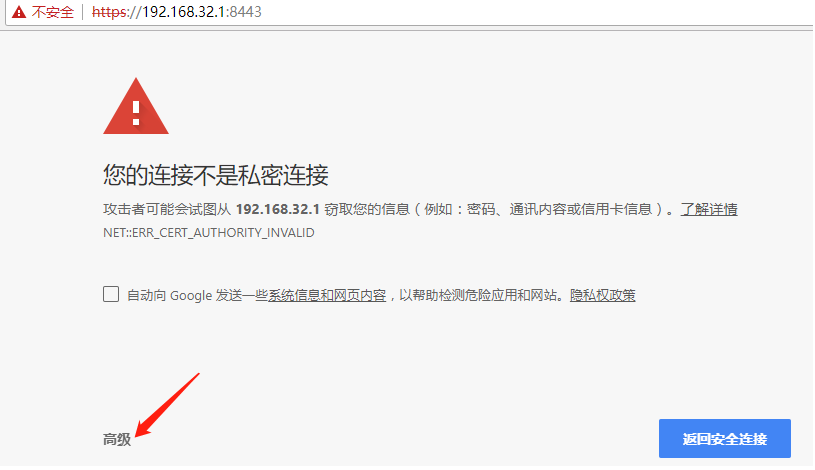

# *** HTTPS配置和编程入门
这篇文章主要关于HTTPS服务器端的配置和客户端访问方法的，只涉及到单向认证，也就是客户端信任服务器。

文中会涉及到java的keytool工具生成自签名证书及导出证书等操作，以及tomcat怎么配置证书等信息

 ## 1，证书操作
 ### 1.1 生成服务器证书【服务端操作】
 如下命令"keytool -genkeypair"为生成服务器端证书的命令，其中-alias表示别名(一个证书库文件可以存多份秘钥，用别名区分)，-keystore表示秘钥库文件，这个文件在没有的情况下会新建，其他就是秘钥长度、有效期等参数。
```
keytool -genkeypair -alias xuqk -keysize 2048 -keyalg RSA -validity 3650 -keystore tomcatserver.jks -storetype JKS
```
如下为完成的操作，特别注意需要输入秘钥库口令和秘钥口令(顺便说一下JDK默认的秘钥库在$JAVA_HOME/jre/lib/security/cacert文件中，口令为changeit)，每一个秘钥可以单独设置不同的口令，但是秘钥库口令在以后对秘钥库文件进行操作时是需要提供的。
```
keytool -genkeypair -alias xuqk -keysize 2048 -keyalg RSA -validity 3650 -keystore tomcatserver.jks -storetype JKS
    输入密钥库口令:
    再次输入新口令:
    您的名字与姓氏是什么?
      [Unknown]:  xuqk
    您的组织单位名称是什么?
      [Unknown]:  bes
    您的组织名称是什么?
      [Unknown]:  bessystem
    您所在的城市或区域名称是什么?
      [Unknown]:  chongqing
    您所在的省/市/自治区名称是什么?
      [Unknown]:  chongqing
    该单位的双字母国家/地区代码是什么?
      [Unknown]:  CN
    CN=xuqk, OU=bes, O=bessystem, L=chongqing, ST=chongqing, C=CN是否正确?
      [否]:  是
    
    输入 <xuqk> 的密钥口令
            (如果和密钥库口令相同, 按回车):
```
 ### 1.2 导出公钥【服务端操作】
 刚刚生成的秘钥库文件包括了公钥和私钥，我们需要把公钥导出后可以发给需要访问服务的客户端。有的服务如果"***在浏览器可以直接访问***"的话，某些客户端人员也可以在浏览器导出证书。
 如下命令，将从刚刚生成的秘钥库文件tomcatserver.jks中导出公钥，并保存到xuqk.crt中，-file会新生成文件的。这个文件可以发给对应的客户端，客户端需要把这个证书导入到信任的证书库中。
```
keytool -export -alias xuqk -keystore tomcatserver.jks -file xuqk.crt
    输入密钥库口令:
    存储在文件 <xuqk.crt> 中的证书
```

 ### 1.3 导出服务器端公钥证书到客户端信任证书库【客户端操作】
 如下命令为把从客户端获取到的公钥证书<xuqk.crt>导入到客户端的信任证书库中，-keystore在不存在的情况下是会生成的，当-keystore指定的文件不存在时则全新设置秘钥库密码，当文件存在时则提供之前设置的秘钥库密码。此外，为了区分不同的证书，可以通过-alias来指定别名，通常是需要设置的。
```
keytool -importcert -alias xuqk-from-server -file xuqk.crt -keystore trust.jks
```

 ## 2，服务器配置
 如果服务端中间件为Tomcat，则打开conf/server.xml文件，找到8443端口对应的connector，对其进行解注释操作(也就是开启)，然后配置keystoreFile为生成的证书库文件路径，keystorePass为秘钥库口令。
```
    <Connector port="8443" protocol="org.apache.coyote.http11.Http11Protocol" SSLEnabled="true"
               maxThreads="150" scheme="https" secure="true"
               clientAuth="false" sslProtocol="TLS"
			   keystoreFile="E:\docs\https\tomcat-keyfile\tomcatserver.jks"  
               keystorePass="12345678"  />
```
以上配置好之后就可以启动tomcat了。
正常启动的话，我们能在启动的窗口或者是日志中看到“Starting ProtocolHandler ["http-bio-8443"]”字样，说明https服务对应的8443正常监听了。
```
信息: Deploying web application directory D:\tools\tomcat-7.0.42\webapps\ROOT
五月 25, 2019 3:05:36 下午 org.apache.coyote.AbstractProtocol start
信息: Starting ProtocolHandler ["http-bio-8088"]
五月 25, 2019 3:05:36 下午 org.apache.coyote.AbstractProtocol start
信息: Starting ProtocolHandler ["http-bio-8443"]
五月 25, 2019 3:05:36 下午 org.apache.catalina.startup.Catalina start
信息: Server startup in 716 ms
```

 ## 3，客户端访问
  ### 3.1 浏览器访问
  通过浏览器访问8443端口，会收到安全警告，可以通过高级直接访问。
  
  
  
  在这里顺便说一下，前面提到一个关键字"***在浏览器可以直接访问***",这里相对于某些REST的API服务而言不能从浏览器直接访问。像这种可以直接浏览器访问的服务，在服务器端不能单独提供公钥证书的情况下，可以通过浏览器导入证书到自己的信任证书库(当然前提是确认服务是安全的)。方法为，先从浏览器地址栏直接点击“警告"图标查看证书，然后根据向导就可以导出服务器端公钥。
  
  之后参照"1.3节"就可以把浏览器导出的证书导入到信任证书库，供程序访问方式使用。
  ### 3.2 通过程序访问
  通常我们可能需要通过程序而非浏览器上访问https服务，
  如下为一个简单的http客户端，其中依赖httpclient4，这个可以在apache下载，需要注意的是还依赖别的jar包也需要下载，比如common-codec、common-beanutils等。
  
  通过如下命令即可实现https服务的访问：
```
java -cp ./ com.bes.test.ClientCustomSSL https://localhost:8443
```
  但是，这个命令是会失败的，错误信息中会看到关键字：javax.net.ssl.SSLHandshakeException，这就是因为客户端没有信任服务端。
  
```
Exception in thread "main" javax.net.ssl.SSLHandshakeException: sun.security.validator.ValidatorException: PKIX path building failed: sun.security.provider.certpath.SunCertPathBuilderException: unable to find valid certification path to requested target
        at sun.security.ssl.Alerts.getSSLException(Alerts.java:192)
        at sun.security.ssl.SSLSocketImpl.fatal(SSLSocketImpl.java:1949)
        ......
Caused by: sun.security.validator.ValidatorException: PKIX path building failed: sun.security.provider.certpath.SunCertPathBuilderException: unable to find valid certification path to requested target
        at sun.security.validator.PKIXValidator.doBuild(PKIXValidator.java:387)
```
以上错误解决的办法是，设置javax.net.ssl.trustStore和javax.net.ssl.trustStorePassword参数，具体的值就看"1.3"步骤中指定的信任证书秘钥库文件路径及口令。

```
java -Djavax.net.ssl.trustStore=./trust.jks -Djavax.net.ssl.trustStorePassword=12345678 -cp ./ com.bes.test.ClientCustomSSL https://localhost:8443/
```

httpclient的java代码如下所示：
```
package com.bes.test;

import java.io.File;
import java.io.FileInputStream;
import java.security.KeyStore;

import javax.net.ssl.SSLContext;

import org.apache.http.HttpEntity;
import org.apache.http.client.methods.CloseableHttpResponse;
import org.apache.http.client.methods.HttpGet;
import org.apache.http.conn.ssl.SSLContexts;
import org.apache.http.conn.ssl.SSLConnectionSocketFactory;
import org.apache.http.conn.ssl.TrustSelfSignedStrategy;
import org.apache.http.impl.client.CloseableHttpClient;
import org.apache.http.impl.client.HttpClients;
import org.apache.http.util.EntityUtils;

public class ClientCustomSSL 
{
    public final static void main(String[] args) throws Exception {
        if(args.length < 1){
            System.out.println("Usage: java com.bes.test.ClientCustomSSL $https_url");
            System.exit(1);
        }

        CloseableHttpClient httpclient = HttpClients.createDefault();
        try {
            HttpGet httpget = new HttpGet(args[0]);
            System.out.println("executing request" + httpget.getRequestLine());

            CloseableHttpResponse response = httpclient.execute(httpget);
            String result="";
            try {
                HttpEntity entity = response.getEntity();

                System.out.println("----------------------------------------");
                System.out.println(response.getStatusLine());
                if (entity != null) {
                    System.out.println("Response content length: " + entity.getContentLength());
                    if (response.getStatusLine().getStatusCode() == 200) {
                        result= EntityUtils.toString(response.getEntity(),"utf-8");
                        System.out.println("Response content: " + result);
                    }
                }
                EntityUtils.consume(entity);
            } finally {
                response.close();
            }
        } finally {
            httpclient.close();
        }
    }
}

```
 ## 3.3 常见问题
 在使用程序访问https时，证书正常的进行了导入，在启动参数中也增加了配置，但经常遇到下面的错误。
```
Exception in thread "main" javax.net.ssl.SSLException: hostname in certificate didn't match: <172.18.132.73> != <xxx.xxx.com>
        at org.apache.http.conn.ssl.AbstractVerifier.verify(AbstractVerifier.java:238)
        at org.apache.http.conn.ssl.BrowserCompatHostnameVerifier.verify(BrowserCompatHostnameVerifier.java:54)
        at org.apache.http.conn.ssl.AbstractVerifier.verify(AbstractVerifier.java:159)
        at org.apache.http.conn.ssl.AbstractVerifier.verify(AbstractVerifier.java:140)
        at org.apache.http.conn.ssl.SSLConnectionSocketFactory.verifyHostname(SSLConnectionSocketFactory.java:301)
```
这个错误是因为访问的域名和证书中的CN对应不上，通常由两种解决方案：

1、如果CN设置了域名，那么可以在客户端主机添加域名到实际IP地址的映射

2、在代码中配置通过使用SSLConnectionSocketFactory.ALLOW_ALL_HOSTNAME_VERIFIER来实现。
SSLConnectionSocketFactory sslsf = new SSLConnectionSocketFactory(...,SSLConnectionSocketFactory.ALLOW_ALL_HOSTNAME_VERIFIER)
以实现"不对主机名进行验证"。

可以通过keytool -v -list查看证书中指定的CN，通常CN就是我们说的域名。
```
*******************************************
keytool -v -list -keystore ./trust.jks
...
别名: esight-local-32150
创建日期: 2019-5-25
条目类型: trustedCertEntry

所有者: CN=192.168.32.150, OU=bes, O=bessystem, L=chongqing, ST=chongqing, C=CN
发布者: CN=192.168.32.150, OU=bes, O=bessystem, L=chongqing, ST=chongqing, C=CN
序列号: 783dc37f
有效期开始日期: Sat May 25 09:31:53 CST 2019, 截止日期: Tue May 22 09:31:53 CST 2029
```

