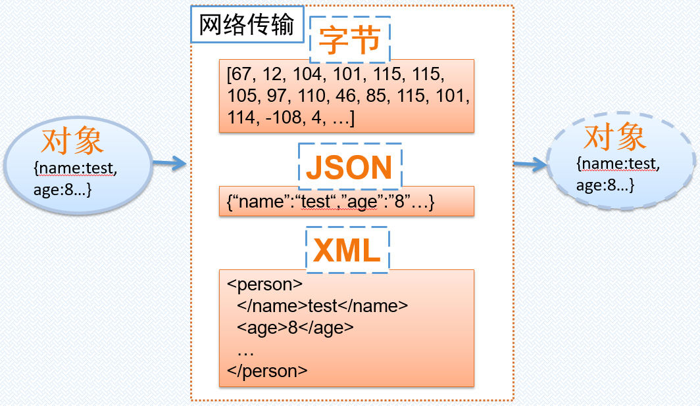
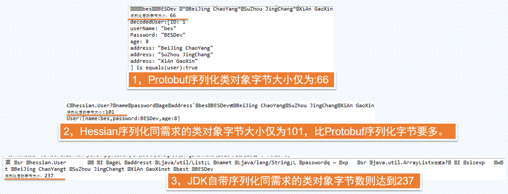

This is my second ARTS, i feel lighter than the first time.
# **1.Algorithm**
**Question：**

Given an array of integers, return indices of the two numbers such that they add up to a specific target.
You may assume that each input would have exactly one solution, and you may not use the same element twice.

**Example:**
```javascript
Input: (2 -> 4 -> 3) + (5 -> 6 -> 4)
Output: 7 -> 0 -> 8
Explanation: 342 + 465 = 807.
```
**My Solution in Python3:**
```python
# Definition for singly-linked list.
# class ListNode:
#     def __init__(self, x):
#         self.val = x
#         self.next = None

class Solution:
    def addTwoNumbers(self, l1, l2):
        """
        :type l1: ListNode
        :type l2: ListNode
        :rtype: ListNode
        """

        '''Transfer all the input l1 and l2 to list'''
        l1List = self.node2List(l1)
        l2List = self.node2List(l2)
        l1List.reverse()
        l2List.reverse()

        minLen = min(len(l1List),len(l2List))
        """ ex: 9+8=17,so carryDigit is 1; 5+4=9 so it no carryDigit """
        carryDigit = 0
        count = 0
        sumList = []
        ''' Compute the aligned digit of two numbers, it's neccessary to handle remainder of the sum of two Numbers.'''
        while(count < minLen):
            a = l1List.pop()
            b = l2List.pop()
            tmpSum = a + b + carryDigit
            sumList.append(tmpSum % 10)
            carryDigit = 1 if tmpSum >= 10 else 0
            count += 1

        ''' if length of two number list is equal, there will be no remaining digit, so just process the last carry digit '''
        if len(l1List) != len(l2List):
            """ Process the remaining digit, it is neccessary to add carryDigit to remaining digit """
            remainDigitsList = l1List if len(l1List) else l2List
            while(len(remainDigitsList)):
                tmpSum = remainDigitsList.pop() + carryDigit
                sumList.append(tmpSum % 10)
                carryDigit = 1 if tmpSum >= 10 else 0
                
        if carryDigit:
            sumList.append(carryDigit)

        return sumList

    '''
    Transfer the "ListNode" to list, ex:
        input: 2 -> 3 -> 5- > 9
        output: [2,3,5,9]
    '''
    def node2List(self,myNode):
        tmpNode = myNode
        lList = []
        while(tmpNode != None):
            lList.append(tmpNode.val)
            if tmpNode.next != None:
                tmpNode = tmpNode.next
            else:
                tmpNode = None
        return lList
```

## **Notice**
In this problem, we should notice the following:

we must process the carry digit correctly, especially the last one. it's too easy to ignore adding to the result list.
the code as following is ignored at my first time submission.
```python
        if carryDigit:
            sumList.append(carryDigit)
        return sumList
```

# **2.Review**

I read this article about "C++ Variables and Data Types", The origin url is:https://medium.com/@chrisamirani/c-variables-and-data-types-part-1-4ebda85eccf8

The writer mention it is compulsory to declare to type of variable when define it. as we know c/c++、java are the strongly typed languages, and that python and go are weakly typed language.

We must declare the type of variable in strongly typed languages, this help us to control memory usage precisely. eg: When we use Numeric varible, we could choose the type order by "byte->short->int->double" in c and java language, the later use more memory than before it.

# **3.Tips**
关于在Docker环境下获取操作系统登录用户名的问题，getlogin()和getuid()比较。Docker基础镜像为：yjjy0921/redhat7.2

### **3.1 具体问题**
在迁移某个应用到Docker环境时发现因为调用操作系统的getlogin()方法(sys/types.h)获取不到登录用户调用导致strcpy函数的调用直接core了。
当时是从Redhat7.2宿主机迁移到运行Redhat7.2的Docker容器中。

出问题的代码如下：getlogin() 的调用不能获取到登录用户名，没有返回值，这导致了后边的"strcpy(a,getlogin());"代码core
```c++
#include <cstdio>
#include <iostream>
#include <string.h>
#include <sys/types.h>
#include <unistd.h>

int main(int argc, char *argv[])
{
    std::cout << "Start" << std::endl;
    std::cout << "Start2,Next is getlogin() function test." << std::endl;
    std::cout << getlogin() << std::endl;
    std::cout << "Start3, Invoked getlogin() function." << std::endl;
    
    char a[30];
    strcpy(a,getlogin());
    std::cout << a << std::endl;
    std::cout << "Hello world" << std::endl;
    return 0;
}
```
### **3.2 原因分析**
 经查与/var/run/utmp文件有关，使用docker cp命令拷贝内网宿主机上的/var/run/utmp文件到容器对应的/var/run/utmp也不行，最后的解决方法是在外网找到一个redhat7.2，拷贝/var/run/utmp文件到镜像中得以解决。
但这不是最终解决方案，最后在stackoverflow上发现如果一定需要获取登录用户的话建议代码调整为通过getuid方法获取。getlogin()是一个不安全的方法，不推荐，详见：https://stackoverflow.com/questions/4785126/getlogin-c-function-returns-null-and-error-no-such-file-or-directory。

### **3.3 解决方案**
建议参照如下样例代码调整，采用getuid方法可以很有效的规避getlogin方法受/var/run/utmp文件影响，以及存在的安全性问题：
```python

#include <unistd.h>
#include <stdio.h>
#include <pwd.h>
#include <sys/types.h>
int main() {
   char *name;
   struct passwd *pass;
   pass = getpwuid(getuid());
   name = pass->pw_name;
   printf("This is the login name: %s\n", name);
   return 0;
}
```

# **4.浅谈序列化技术**
### **4.1 序列化比较**
这次以Java为例，谈一下序列化的场景。

序列化按照类别大概是如下两种序列化，一个针对字节码、一个针对格式化的字符串。

1，字节码序列化技术：Protobuf、Hessian、Java序列化

2，Json和xml序列化技术：jackjson、xstream等

如下图所示，在分布式环境中客户端和服务器端通信涉及到的序列化技术，其中早期的SOAP WebService实现中大量使用XML格式，后来Restful接口的Web
Service则使用JSON格式。未来，Docker和K8S的YAML格式会不会有可能用作这种远程调用？  而基于内网的远程调用框架gRPC、Thrift、ICE、Dubbo等底层采用不同的序列化技术，而一些商用的中间件在分布式调用中则有自己的调用协议(如Weblogic T3)，底层的序列化技术很可能采用的就是以上字节码序列化技术中的一种。



### **4.2 各种序列化框架的使用方法**
#### **4.2.1 序列化对象概述**
我们本次使用序列化采用如下Java代码示例的User对象，其有名称、密码、年龄、地址(可多个)属性。

```java
import java.io.Serializable;
import java.util.ArrayList;
import java.util.List;

public class User implements Serializable{
	private static final long serialVersionUID = 1L;
	
	private String name;
	private String password;
	private int age;
	private List<String> address = new ArrayList<String>();
	public String getName() {
		return name;
	}
	public void setName(String name) {
		this.name = name;
	}
	public String getPassword() {
		return password;
	}
	public void setPassword(String password) {
		this.password = password;
	}
	public int getAge() {
		return age;
	}
	public void setAge(int age) {
		this.age = age;
	}
	public List<String> getAddress() {
		return address;
	}
	public void setAddress(List<String> address) {
		this.address = address;
	}
}
```

我们的测试代码中，将会使用具备相同属性值的对象，会简单比较序列化字节数大小及使用方法。
```java
		// 构造测试对象
		User user = new User();
		user.setName("bes");
		user.setPassword("BESDev");
		user.setAge(8);
		
		user.getAddress().add("BeiJing ChaoYang");
		user.getAddress().add("SuZhou JingChang");
		user.getAddress().add("XiAn GaoXin");
```

#### **4.2.2 JDK序列化**
JDK的序列化使用是最简单的，只需要保证需要序列化的类实现java.io.Serializable接口后，使用java.io.ObjectOutputStream类的writeObject和readObject便可以实现序列化和反序列化，如下示例代码：
```java
package serialize;

import java.io.ByteArrayOutputStream;
import java.io.IOException;
import java.io.ObjectOutputStream;

import hessian.User;

public class JDKSerializeMain {
	public static void main(String[] args) throws Exception {
		// 构造测试对象
		User user = new User();
		user.setName("bes");
		user.setPassword("BESDev");
		user.setAge(8);
		
		user.getAddress().add("BeiJing ChaoYang");
		user.getAddress().add("SuZhou JingChang");
		user.getAddress().add("XiAn GaoXin");

		ByteArrayOutputStream output = new ByteArrayOutputStream();
		ObjectOutputStream objectOut = null;
		try {
			objectOut = new ObjectOutputStream(output);
			objectOut.writeObject(user);
			objectOut.close();
			output.close();

			System.out.write(output.toByteArray());
			System.out.println();
			System.out.println("序列化后的字节大小：" + output.toByteArray().length);
		} catch (IOException e) {
			e.printStackTrace();
		}
	}
}

```
#### **4.2.3 Hessian序列化**
Hessian序列化跟JDK自带的序列化区别为，需要采用Hessian的Input和Output实现(反)序列化。示例代码如下也很简单。
```java
package hessian;

import java.io.ByteArrayInputStream;
import java.io.ByteArrayOutputStream;

import com.caucho.hessian.io.Hessian2Input;
import com.caucho.hessian.io.Hessian2Output;

public class HessianMain {
	public static void main(String[] args) {
		//构造测试对象
		User user = new User();
		user.setName("bes");
		user.setPassword("BESDev");
		user.setAge(8);
		
		user.getAddress().add("BeiJing ChaoYang");
		user.getAddress().add("SuZhou JingChang");
		user.getAddress().add("XiAn GaoXin");

		try {
			//序列化对象
			ByteArrayOutputStream os = new ByteArrayOutputStream();
			Hessian2Output ho = new Hessian2Output(os);
			ho.writeObject(user);
			//Hessian自带缓冲，需要调用flush操作
			ho.flush();
			byte[] bytes = os.toByteArray();

			System.out.write(bytes);
			System.out.println();
			System.out.println("序列化后的字节大小:" + bytes.length);

			//反序列化对象
			ByteArrayInputStream is = new ByteArrayInputStream(bytes);
			Hessian2Input hi = new Hessian2Input(is);
			User deUser = null;
			deUser = (User) hi.readObject();
			
			System.out.println(
					"User:[name:" + deUser.getName() + ",password:"
			      + deUser.getPassword() + ",age:" + deUser.getAge() + "]");
		} catch (Exception e) {
			e.printStackTrace();
		}

	}
}

```

#### **4.2.4 protobuf序列化**
protobuf框架的使用则需要根据protobuf协议及规定的格式定义需要序列化的对象格式。

1，使用protobuf的第一步就是定义如下的格式(被称为Message)，同前两节的User类。
```docker
package bes;
option java_package="myprotobuf";
option java_outer_classname="UserProto";

message User{
    required int32 ID=1;
    required string userName=2;
    required string Password=3;
    required int32 age=4;
    repeated string address=5;
}
```
2，使用ptotoc命令根据proto文件生成相关语言的Message类及工具类

protoc --java_out ./ User.proto

3，上面protoc命令会编译出UserProto类，主要包括builder和反序列化等的工具类，如UserProto.User.Builder，代码中则使用protoc生成的代码进行序列化和反序列化。
```java
  /**
   * Protobuf type {@code bes.User}
   */
  public  static final class User extends
      com.google.protobuf.GeneratedMessageV3 implements
      // @@protoc_insertion_point(message_implements:bes.User)
      UserOrBuilder {
    // Use User.newBuilder() to construct.
    private User(com.google.protobuf.GeneratedMessageV3.Builder<?> builder) {
      super(builder);
    }
    private User() {
      iD_ = 0;
      userName_ = "";
      password_ = "";
      age_ = 0;
      address_ = com.google.protobuf.LazyStringArrayList.EMPTY;
    }
```
4，真正使用protobuf的示例代码如下：与JDK序列化和hessian框架的不同之处就是序列化和反序列化操作直接使用protoc生成的UserProto类来完成。
```java
package protobuf;

import java.util.ArrayList;
import java.util.List;

import com.google.protobuf.InvalidProtocolBufferException;

import myprotobuf.UserProto;

public class UserSerial {
    public static void main(String[] args)
            throws Exception {

        //创建Builder并设置消息对象User的属性
        UserProto.User.Builder builder = UserProto.User.newBuilder();
        builder.setID(1);
        builder.setUserName("bes");
        builder.setPassword("BESDev");
        builder.setAge(8);
        List<String> address = new ArrayList<String>();
        address.add("BeiJing ChaoYang");
        address.add("SuZhou JingChang");
        address.add("XiAn GaoXin");
        builder.addAllAddress(address);
        
        //使用protoc生成的累build出User对象
        UserProto.User user = builder.build();
        
        //序列化User对象
        byte[] encodedBytes = user.toByteArray();
        System.out.write(encodedBytes);
        System.out.println();
		System.out.println("序列化后的字节大小：" + encodedBytes.length);
        
        //反序列化
        UserProto.User decodedUser = UserProto.User.parseFrom(encodedBytes);
        System.out.println("decodedUser:[" + decodedUser +"] "
        		+ "is equals(user):" + decodedUser.equals(user));

    }

}

```
#### **4.2.5 序列化简单总结**
比较序列化前后的对象，在保证对象序列化前后一致的情况下，测试代码中会打印每次序列化的大小。

如下图是简单的比较


**关于序列化的简单思考：**

1，序列化在分布式系统中广泛使用，如gRPC远程调用框架使用的就是protobuf，Thrift分布式调用框架则有自己的序列化框架，阿里的dubbo则使用hessian序列化技术(也支持json、对protobuf进行扩展等)；

2，序列化技术对掌握分布式技术来说是很重要的，而且对整体性能至关重要；Weblogic中间件的EJB调用性能远高于其他基于IIOP协议的EJB框架的调用性能，其中很重要的一点就是Weblogic T3独有的序列化实现。

3，在目前应用性能监控APM产品中，都在谈的端到端监控，在采用基于HTTP协议通信的系统之间实现相对是比较容易的。而现实中很多系统之间的端到端链路监控因为存在不同的分布式通信协议，协议报文的序列化格式不同。有些系统使用了中间件自身的通信协议，这种情况在使用EJB技术的系统中尤为突出，比如要支持Weblogic下的应用则要分析T3协议。此外不同系统采用不同的分布式框架，端到端监控框架需要对主流的分布式框架进行支持。
