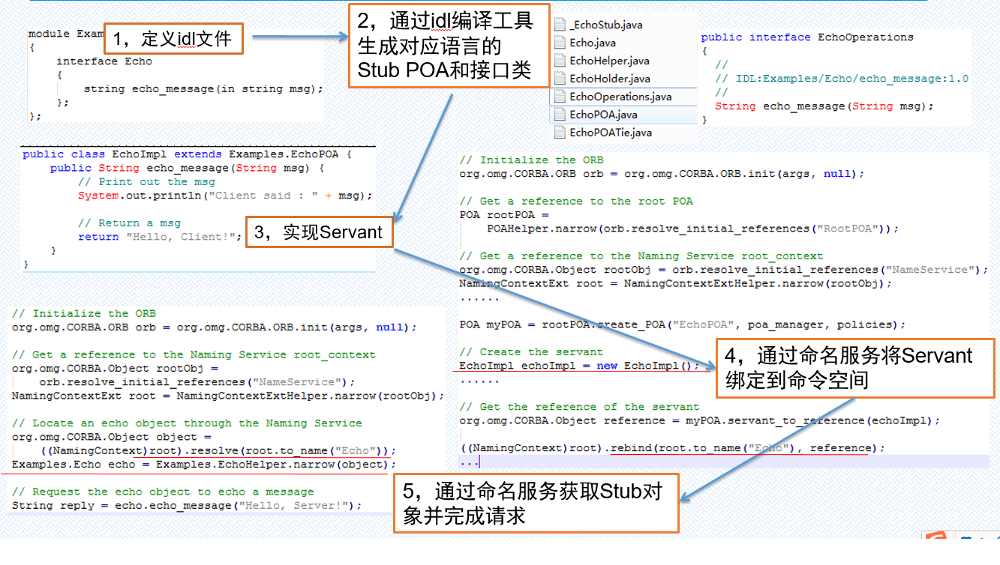

This is my second ARTS, i feel lighter than the first time.
# **1.Algorithm**
**Question：**

Given an array of integers, return indices of the two numbers such that they add up to a specific target.
You may assume that each input would have exactly one solution, and you may not use the same element twice.

**Example:**
```javascript
Input: (2 -> 4 -> 3) + (5 -> 6 -> 4)
Output: 7 -> 0 -> 8
Explanation: 342 + 465 = 807.
```
**My Solution in Python3:**
```python
# Definition for singly-linked list.
# class ListNode:
#     def __init__(self, x):
#         self.val = x
#         self.next = None

class Solution:
    def addTwoNumbers(self, l1, l2):
        """
        :type l1: ListNode
        :type l2: ListNode
        :rtype: ListNode
        """

        '''Transfer all the input l1 and l2 to list'''
        l1List = self.node2List(l1)
        l2List = self.node2List(l2)
        l1List.reverse()
        l2List.reverse()

        minLen = min(len(l1List),len(l2List))
        """ ex: 9+8=17,so carryDigit is 1; 5+4=9 so it no carryDigit """
        carryDigit = 0
        count = 0
        sumList = []
        ''' Compute the aligned digit of two numbers, it's neccessary to handle remainder of the sum of two Numbers.'''
        while(count < minLen):
            a = l1List.pop()
            b = l2List.pop()
            tmpSum = a + b + carryDigit
            sumList.append(tmpSum % 10)
            carryDigit = 1 if tmpSum >= 10 else 0
            count += 1

        ''' if length of two number list is equal, there will be no remaining digit, so just return calculated list '''
        if len(l1List) != len(l2List):
            """ Process the remaining digit, it has no any compute at all, just appending the digit to list """
            remainDigitsList = l1List if len(l1List) else l2List
            while(len(remainDigitsList)):
                tmpSum = remainDigitsList.pop() + carryDigit
                sumList.append(tmpSum % 10)
                carryDigit = 1 if tmpSum >= 10 else 0
                
        if carryDigit:
            sumList.append(carryDigit)

        return sumList

    '''
    Transfer the "ListNode" to list, ex:
        input: 2 -> 3 -> 5- > 9
        output: [2,3,5,9]
    '''
    def node2List(self,myNode):
        tmpNode = myNode
        lList = []
        while(tmpNode != None):
            lList.append(tmpNode.val)
            if tmpNode.next != None:
                tmpNode = tmpNode.next
            else:
                tmpNode = None
        return lList
```

## **Notice**
In this problem, we should notice the following:

we must process the carry digit correctly,it's too easy to ignore adding to the result list.
the code as following is ignored at my first time submission.
```python
        if carryDigit:
            sumList.append(carryDigit)
        return sumList
```

# **2.Review**

本周缺，强烈谴责~_~

# **3.Tips**
关于在Docker环境下获取操作系统登录用户名的问题，getlogin()和getuid()比较。Docker基础镜像为：yjjy0921/redhat7.2

### **3.1 具体问题**
在迁移某个应用到Docker环境时发现因为调用操作系统的getlogin()方法(sys/types.h)获取不到登录用户调用导致strcpy函数的调用直接core了。
当时是从Redhat7.2宿主机迁移到运行Redhat7.2的Docker容器中。

出问题的代码如下：getlogin() 的调用会导致core
```c++
#include <cstdio>
#include <iostream>
#include <string.h>
#include <sys/types.h>
#include <unistd.h>

int main(int argc, char *argv[])
{
    std::cout << "Start" << std::endl;
    std::cout << "Start2,Next is getlogin() function test." << std::endl;
    std::cout << getlogin() << std::endl;
    std::cout << "Start3, Invoked getlogin() function." << std::endl;

    return 0;
}
```
### **3.2 原因分析**
 经查与/var/run/utmp文件有关，使用docker cp命令拷贝内网宿主机上的/var/run/utmp文件到容器对应的/var/run/utmp也不行，最后的解决方法是在外网找到一个redhat7.2，拷贝/var/run/utmp文件到镜像中得以解决。
但这不是最终解决方案，最后在stackoverflow上发现如果一定需要获取登录用户的话建议代码调整为通过getuid方法获取。getlogin()是一个不安全的方法，不推荐，详见：https://stackoverflow.com/questions/4785126/getlogin-c-function-returns-null-and-error-no-such-file-or-directory。

### **3.3 解决方案**
建议参照如下样例代码调整，采用getuid方法可以很有效的规避getlogin方法受/var/run/utmp文件影响，以及存在的安全性问题：
```python

#include <unistd.h>
#include <stdio.h>
#include <pwd.h>
#include <sys/types.h>
int main() {
   char *name;
   struct passwd *pass;
   pass = getpwuid(getuid());
   name = pass->pw_name;
   printf("This is the login name: %s\n", name);
   return 0;
}
```

# **4.Share**

# **4.序列化与分布式**
## 优化docker镜像文件大小

### **4.1 序列化比较**
```shell

```
### **4.2 分布式比较**

```docker

```
这个dockerfile是可以制作出镜像来的，其通过DOCKERFILE的ADD命令解压oracle的依赖库和和应用包到容器镜像，然后还使用了chmod修改文件权限，以及使用rpm安装aio包。
其存在问题：因为docker镜像分层，而且按照Copy On Write的思路，当需要对文件进行修改是就会进行拷贝。这带来的问题是比如oracle.libs.tar.gz文件本身比较大，ADD之后又使用chmod命令对其权限修改为755，这个chmod会导致一次文件拷贝，就无形中增加了docker镜像大小。

## **4.3 优化版本**
