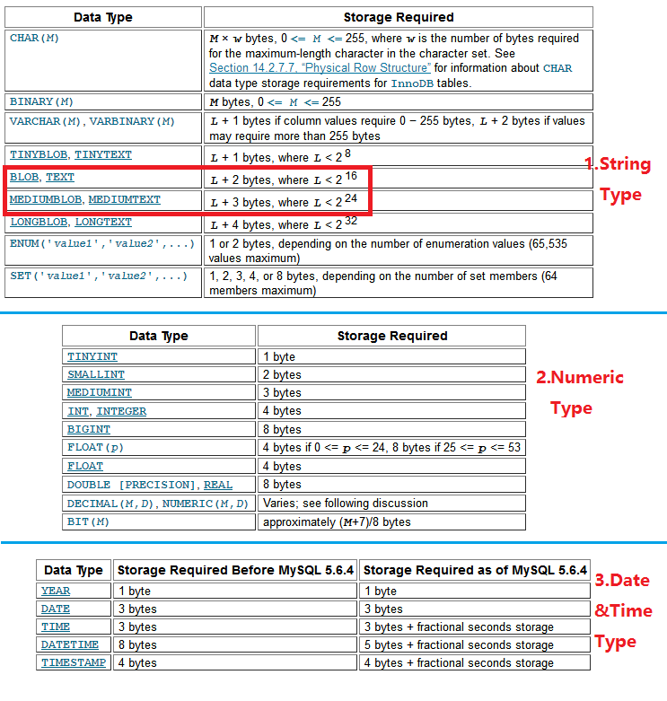

This is 3rd ARTS, The Algorithm is still difficult for me.
# **1.Algorithm**
**Question：**

Given a string, find the length of the longest substring without repeating characters.

**Example:**
```javascript
Given "abcabcbb", the answer is "abc", which the length is 3.
Given "bbbbb", the answer is "b", with the length of 1.
Given "pwwkew", the answer is "wke", with the length of 3. Note that the answer must be a substring, "pwke" is a subsequence and not a substring.
```

**My Solution in Python3:**
```python
class Solution:
    def lengthOfLongestSubstring(self, s):
        """
        :type s: str
        :rtype: int
        """
        
        ''' It's neccessary to process the string which be empty or all space'''
        if len(s) == 0:
            return 0
        elif s.isspace():
            return 0
            
        strLen = len(s)
        '''tmpDict is the intermiation result, it story the length and the index of substring temporary'''
        tmpDict = {'length':1,"range":(0,1)}

        for i in range(0,strLen):
            for j in range(i+1,strLen):
                '''d
                If found the duplicated string or j was reached the biggest index, we should check the tmpDict.
                '''
                if s[j] in s[i:j]:
                    tmpLen = j - i
                    if tmpLen > tmpDict["length"]:
                        tmpDict = {'length':tmpLen,"range":(i,j)}
                    i = s.index(s[j],i,j) + 1
                    break
                elif j == strLen-1:
                    tmpLen = (j - i) + 1
                    if tmpLen > tmpDict["length"]:
                        tmpDict = {'length':tmpLen,"range":(i,j)}

        return tmpDict["length"]

```

## **Notice**
As an engineer which has decade-long experience with coding, i made the following mistake unexpectedly.

1,I neglectted processing the empty string unexpectedly at the first submission, so it will wrongly return 1 when the empty string as the input.

2,If the input string is wholly substring which has no any duplicated character, i return the number which be less than the string's length. eg: return the 1 when input string is "au".
the following code is neccessary
```python
                elif j == strLen-1:
                    tmpLen = (j - i) + 1
                    if tmpLen > tmpDict["length"]:
                        tmpDict = {'length':tmpLen,"range":(i,j)}
```

when i committed the right code to the leetcode, i found it's very inefficient. Many knowledge of algorithm is waiting for me...

# **2.Review**

I read this article about "the monitor metric data storing", The origin url is:https://blog.timescale.com/sql-nosql-data-storage-for-prometheus-devops-monitoring-postgresql-timescaledb-time-series-3cde27fd1e07

As metioned in this article, prometheus is the internal monitoring system Google developed for Borg, and along with the popularity of Kubernetes. Prometheus grabbed attention from so many developers.

As we know, the metric data is large, so we must use reliable data store system to dealing the challenge of storage. 

Tranditianal APM(Application monitor) software uses the Mysql to store statistical data and Hbase to store the detail data(e.g. the code invoking stack of one request).

If we use Docker for running my application, The more application instance, The heavier metric data is, use PostgreSQL + TimescaleDB(be packaged as a PostgreSQL extension) perhaps is one good choice. I will try it later by buiding test environment.

B.T.W:The grafana is good UI dashboard framework of monitor!

# **3.Tips**
关于Mysql数据库字符型消息存储限制问题

### **3.1 具体问题**
我们运维产品有一个功能就是作业执行，作业可以调用某台主机上的脚本，但是界面需要输出脚本的"标准输出"。而每个作业调用脚本的标准输出是需要存储到数据库中供以后查看的，这种执行了4次作业调度，但是其中有一次作业看不到在浏览器界面看不到标准输出。


### **3.2 原因分析**
通过分析作业标准输出的流向:执行作业(调用脚本)的主机->数据库->界面。很容易想到查看执行作业主机上的代理端的日志，通过分析一下子找到原因，日志中有明显的字段超限错误：

```python
MysqlDataTruncation: Data Truncation: Data too long for column "xxx" at row 1
```

### **3.3 解决方案**
产品开发后运行两三年了，没有想到标准输出居然超限了，产品发布上线后数据库中对应的字段类型为Text。后来仔细看了Mysql的手册，发现TEXT最大可接受的是2^16(65536)字节，因此就当场就把数据库字段类型从TEXT变为MEDIUMTEXT(2^24)
```python

ALTER TABLE xxx MODIFY COLUMN yyy MEDIUMTEXT BINARY NULL;
```

MYSQL字符、数字、时间字段存储的空间大小要求如下所示：


# **4.Share(浅谈配置管理工具)**

对于我们日常运维来说，如果是一两台或者几台机器运维的话，可能我们要操作的时候通过登陆每台机器进行配置，或者是通过ssh去做批量配置。但如果机器数量大几十上百成千台的时候还采用这种方式效率就难以想象了。因此我们一般都需要引入专门的配置管理软件。
目前流行的有Puppet(使用ruby开发)、Chef(使用ruby开发)、Ansible(使用python开发)、SaltStack(使用python开发)等。
工具的管理分为有代理(Agent)和无代理模式(Agentless):

1,代理(Agent)模式：有一个代理进程运行在被监控端，接收服务端的命令完成配置管理工作。

2,无代理(Agentless)模式：不需要在远程主机上安装client/agents，因为它们是基于ssh或其他服务(消息中间件)来和远程主机通讯的。

### **4.1 Puppet**
Puppet是开源的基于Ruby的系统配置管理工具，依赖于C/S的部署架构。Puppet视配置文件、用户、软件包、系统服务等为“资源”。每种资源都有对应的属性，如软件包有安装不安装的属性，文件有权限属性等。Puppet的代码主要由这些资源和其属性组成。

#### **4.1.1 Puppet数据流如下所示：


#### **4.1.2 Puppet的简单使用如下图所示：

主要展示文件同步的实现


#### **4.1.3 Puppet常用的资源管理类定义
这些资源定义主要书写在".pp"为后缀文件中即可

-文件推送定义：如下为要求所有主机需要同步服务器上的my.cf文件到/etc/mysql/my.cnf
```python
file { 
    "/etc/mysql/my.cnf": 
    source => "puppet:///mysql-server/my.cnf", 
    owner => root, 
    group => root, 
    mode => 0644;        
}
```
-软件包安装：
```python
package { 
      ["nginx","mysql-server"]: 
      ensure => installed; 
      ["vim"]: 
      ensure => absent; 
}
```
-执行cron定时任务
```python
cron{  
 "ntpdate":  
  command => "/usr/sbin/ntpdate pool.ntp.org",  
  user => root,  
  hour => 0,  
  minute => 0,  
  } 
```
-执行固定命令
```python
exec {  
  "/tmp/nginx_install.sh":  
  cwd => "/tmp",  
  user => root,  
  path => ["/usr/bin","/usr/sbin","/bin","/bin/sh"],  
  }
```


### **4.2 Chef**
类似Puppet的配置管理工具，也视配置文件、用户、软件包、系统服务等为“资源”。

#### **4.2.1 Chef架构和简单说明如下所示：


#### **4.2.2 Chef的简单使用如下图所示：

可以通过查看下图中文件配置和命令执行，也基本可以看出和Puppet有几分神似。


### **4.3 Ansible**
Ansible被定义为一个模型驱动的配置管理器，支持多节点发布、远程任务执行。默认使用 SSH 进行远程连接。
Ansible无需在被管理节点上安装附加软件，可使用各种编程语言进行扩展。轻量可能成为Ansible流行的最大原因之一。

#### **4.3.1 必须说明的基础概念：
Host Inventory：指定操作的主机,是一个配置文件里面定义监控的主机。需要被管理的主机定义在该文件中。
PlayBooks ： 定义编排任务，由ansible自动执行一系列命令。命令组成PlayBook
Module：Ping,command,user,yum等等模块，通过模块完成相应管理工作。
连接方式：管理端(也就是运行ansible命令的机器)通过local 、ssh、zeromq 三种方式连接被管理端，默认使用基于ssh的连接。

#### **4.3.2 Ansible基本使用：

Ansible的使用是最简单，在安装完成之后默认就有command这样的模块存在，所以只需要把被管主机添加进来便可以远程执行命令。
真是相当方便，要想马上感知的话只需要下面两条命令。

1，配置hosts文件,定义组和相应主机：如下在管理主机上定义了两个主机组
```python
vi /etc/ansible/hosts
---------------------
[webservers]
rhel7161
rhel7160
[dummy_group]
192.168.1.111
192.168.1.112
```

2，在管理主机通过ansible执行远程命令，如下图所示在所有主机上查询jdk的版本信息：


#### **4.3.3 Ansible深度定制安装配置：
如果需要执行安装操作的话，可以更细粒度的编排来完成，如下图为定义tomcat的安装：


### **4.4 Salt**
这次对Salt看得比较浅，也没有搭建成功测试环境，但给出下面的图示展示Salt的使用，可以看出使用也是比较简单的。


#### **4.5 分布式配置总结**
在面对批量配置的工作，我推测ansible的使用现在应该是最流行的。
在很多公司都有自己的配置框架，有些是基于以上开源产品其中之一进行搭建。
也有自行开发远程配置框架完成如下工作的：
1，批量作业执行
2，批量软件(特别是中间件)安装和配置
3，自动巡检(基于远程作业实现主机存储空间，CPU，内存等的自动巡检)

国内也有腾讯蓝鲸这样的平台。
