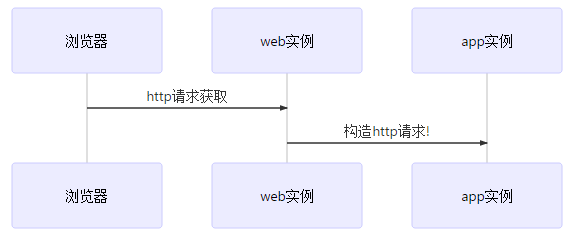
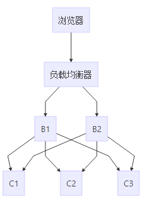
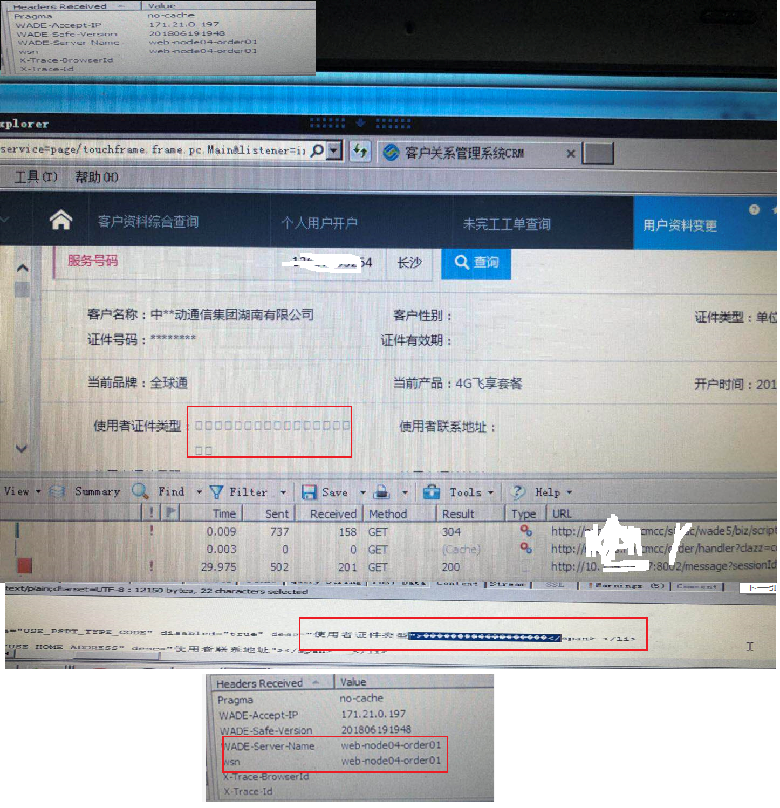

This is 5th ARTS, The Algorithm is still difficult for me again and again.

# 1.Algorithm

# 2.Review

# 3.Tips
说说一次"**奇葩**"的乱码之旅。

**背景**：我们在生产环境对应用进行测试，架构相对比较复杂，涉及到很多个业务系统。运行了几百个中间件实例，大的架构方面：**浏览器**<->**web实例的中间件**(类似Tomcat)<->**app实例的中间件**(类似Tomcat)，这里边有大量的AJAX请求。



[^_^]:

  ```
  sequenceDiagram
  浏览器->>web实例: http请求获取
  web实例->>app实例: 构造http请求!
  ```

采用了常规的负载均衡，请求在70多台机器的700多个实例上流转，类如下图，**Bx**是web实例集群，**Cx**是app实例集群。


[^_^]:
  ```
  graph TD
  浏览器-->负载均衡器
  负载均衡器-->B1
  负载均衡器-->B2
  B1-->C1
  B1-->C2
  B1-->C3
  B2-->C1
  B2-->C2
  B2-->C3

  ```

**防乱码准备工作**：我们给Tomcat中间件配置了uriEncoding=UTF-8、useBodyEncodingForURI=true、默认的contentType为text/html;charset=UTF-8等。并**抽查了**多数中间件实例的JVM参数，放心地以为全是file.encoding=UTF-8。此外，应用中也有很多配置请求参数和相应参数编码的配置。

**问题点**：如图片所示，部分页面的部分字段出现乱码，然而如果对乱码页面进行刷新发现，只有某几次请求是乱码的。



**诊断过程**：我们很容易想到这个问题出错的只是后端的部分应用实例，当负载均衡请求被发送到有问题的实例时页面就会乱码，这是偶现问题。那么我们前面已经做了很多跟编码相关的配置，为什么还会出现乱码？在后端几十台主机和几百个应用实例中怎么准确找出问题实例成为首要的任务。当然肯定有人会问为什么测试不能针对具体的主机(这个主要是网络环境和数据原因)。

通过httpwatch抓取，频繁刷新页面直到乱码页面产生。在前面问题浮现的图中最下面我贴出了HTTP相应头，还好，应用会把后端应用实例的名称放到http头中，所以乱码页面很容易就定位到主机。然后接下来就是仔细查看主机上对应的Web实例日志，查找乱码时刻前后的日志进行分析，最后发现了web实例日志中**构造请求时的请求体就是乱码的**。这个乱码是web实例读取本地文件模板构造请求发往app实例，从而从数据库中获取数据：


```
checkContracNew:{"SUBMIT_TYPE":"submit","listener":"onTradeSubmit","DEPOSIT_FEE":"0","GIFT_FEE":"2500","CHANGEPRODUCT_INFO":"{\"PRODUCT_ID\":\"99813102\",\"YY\":[{\"IS_EXIST\":\"TRUE\",\"ELEM_KEY\":\"99813112_D_0\",\"PRODUCT_ID\":\"99
813102\",\"PACKAGE_ID\":\"VOICE\",\"ELEMENT_ID\":\"99813112\",\"ELEMENT_TYPE_CODE\":\"D\",\"ELEMENT_NAME\":\"???????99 ??\",\"PRICE\":\"9900\",\"PACKAGE_KIND_CODE\":\"YY\",\"MODIFY_TAG\":\"0\"}]}","SERIAL_NUMBER":"18817036279","MONTHS":"
24","EXEC_ACTION":"undefined","CONSUME_KMNUM":"99","REMARK":"","CHECK_MODE":"0","IS_CASH_VOUCHER_CREATE":"1","service":"ajax"}
```

然后跟应用厂商沟通，确认了确实存在读取文件的操作，进而很快想到可能是file.encoding配置问题，就很快检查出现乱码是处理请求的实例的JVM参数确实跟没有问题的有区别。

```
file.encoding = ANSI_X3.4-1968 //产生乱码的应用中间件实例
file.encoding = UTF-8 //正常的应用中间件实例
```
检查主机上的local和LANG均是相同的zh_CN.UTF-8,运行简单的Java程序发现-Dfile.encoding也是UTF-8,而中间件上则有区别，这个感觉比较诡异，但没有细查了。

**最后为了屏蔽配置差异，给700多个中间件实例强行设置-Dfile.encoding=UTF-8后解决**。

# 4.Share
来说说IPV6，以Redhat6为例，IPV6配置方法：

/etc/sysconfig/network文件增加如下配置：

```
NETWORKING_IPV6=yes
```

