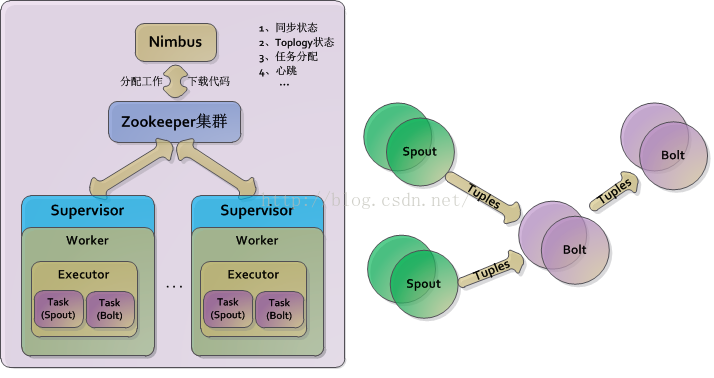
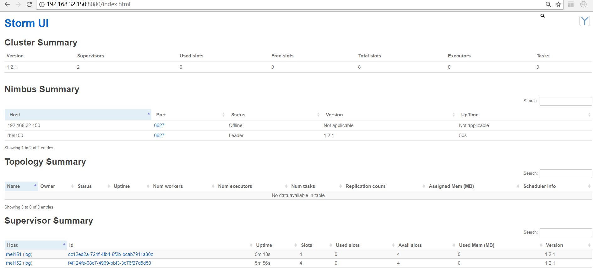

This is 6th ARTS, The Algorithm is still difficult for me again and again.

# 1.Algorithm
### Question: 
Determine whether an integer is a palindrome. An integer is a palindrome when it reads the same backward as forward.

```
Example 1:
Input: 121
Output: true

Example 2:
Input: -121
Output: false
Explanation: From left to right, it reads -121. From right to left, it becomes 121-. Therefore it is not a palindrome.

Example 3:
Input: 10
Output: false
Explanation: Reads 01 from right to left. Therefore it is not a palindrome.
```

### My solution in python3 is:

```
class Solution:
    def isPalindrome(self, x):
        """
        :type x: int
        :rtype: bool
        """

        # the special case
        if x < 0: # when x is minus, x is not a palindrome.
            return False
        if x < 10:  # if the number has only one digit, it is always Palindrome
            return True
        if x % 10 == 0: # if the last digit of the number is 0, return False directly.
            return False
        
        revertedX = 0
        while x > revertedX:
            revertedX = (revertedX * 10) + (x % 10)
            x = x // 10 # Must use the "//"(exact division) other than "/" 
        
        print("x is %d and revertedX is %d" % (x,revertedX))
-         if x == revertedX:
            return True
        # when the length of number is odd, we should omit the middle number. eg: 12321, we get x=12 and revertedX = 123
        elif x == revertedX // 10:
            return True
        
        return False
```
At the first time,  I made a mistake that use the "/"(division) other than the "//"(exact division).

# 2.Review
Today i read an artical about “Practical Advice for Women Beginning Their Computer Science Degree” the link is: https://medium.com/@NSallakAnderson/practical-advice-for-women-beginning-their-computer-science-degree-6bfb09197a7b

In this artical, i studied some useful sentence, eg：
- As August winds down： means It's time for staring classes.
- It was a while ago, but often it feels like yesterday. : means someone can clearly remember something.
- For I too was in your shoes: means someone think about the feelings of others.

# 3.Tips
同事在实施的时候遇到一个大小为60T的磁盘，产品虽说耗存储空间，但之前客户一般都给分布式存储，或者是最大不超过2T的存储盘。看到60T我们都比较感叹说这客户真豪！但因第一次遇到这种还需要自己格式化的盘，所以有点懵逼了，对于这样大存储空间的盘怎么格式化，选择什么类型？都成为问题，后来查询资料。

涉及到两方面，一是分区类型（ＭＢＲ和ＧＰＴ），一种是文件类型（ext4 xfs等）

MBR: MBR只支持最多4个主分区，如果需要更多分区的话，需要在磁盘上新建扩展分区(extended partition)， and only works with disks up to 2 TB in size.

GPT: GPT则支持更多的分区数量，其支持的文件系统大小取决于操作系统和文件类型，如下为以Redhat5~7为例主要文件系统类型对应的size大小。

Filesystem | RHEL 5 | RHEL 6 |  RHEL 7 |
---|---|---|---|
EXT2/3 | 8TiB (5.0), 16TiB (5.1+) | 16TiB |　16TiB
EXT4 | 16TiB [1EiB] (5.6+) | 16TiB |　50TiB [1EiB]
XFS | 100TiB [16EiB] | 300TiB [16EiB] |　500TiB [16EiB]

基于以上分析，60T的硬盘在分区是需要指定为"GPT"类型，并选择"XFS"文件系统类型。

如下为样例：这里为了演示目的，选择了一个1G大小的新增加磁盘进行操作

第一步：parted对/dev/sdb磁盘进行格式化

```
[root@rhel7 ~]# parted /dev/sdb
GNU Parted 3.1
使用 /dev/sdb
Welcome to GNU Parted! Type 'help' to view a list of commands.
(parted) mklabel                                                          
新的磁盘标签类型？ gpt                    #这里在mklabel时选择gpt                                
(parted) mkpart                         #开始分区                              
分区名称？  []? gpt1
文件系统类型？  [ext2]? xfs                                               
起始点？ 0                                                                
结束点？ 1G                                                               
警告: The resulting partition is not properly aligned for best performance.
忽略/Ignore/放弃/Cancel? I                                                
(parted) print                          #查看分区信息                                  
Model: VMware, VMware Virtual S (scsi)
Disk /dev/sdb: 1074MB
Sector size (logical/physical): 512B/512B
Partition Table: gpt
Disk Flags: 

Number  Start   End     Size    File system  Name  标志
 1      17.4kB  1074MB  1074MB               gpt1
```

第二步：使用操作系统的mkfs格式化文件为xfs类型

```
[root@rhel7 ~]# mkfs -t xfs /dev/sdb1
meta-data=/dev/sdb1              isize=256    agcount=4, agsize=65534 blks
         =                       sectsz=512   attr=2, projid32bit=1
         =                       crc=0        finobt=0
data     =                       bsize=4096   blocks=262135, imaxpct=25
         =                       sunit=0      swidth=0 blks
naming   =version 2              bsize=4096   ascii-ci=0 ftype=0
log      =internal log           bsize=4096   blocks=853, version=2
         =                       sectsz=512   sunit=0 blks, lazy-count=1
realtime =none                   extsz=4096   blocks=0, rtextents=0

```
查看格式化的结果，可以看到新增加的sdb

```
[root@rhel7 ~]# fdisk -l

磁盘 /dev/sda：64.4 GB, 64424509440 字节，125829120 个扇区
Units = 扇区 of 1 * 512 = 512 bytes
扇区大小(逻辑/物理)：512 字节 / 512 字节
I/O 大小(最小/最佳)：512 字节 / 512 字节
磁盘标签类型：dos
磁盘标识符：0x000dfcd6

   设备 Boot      Start         End      Blocks   Id  System
/dev/sda1   *        2048     1026047      512000   83  Linux
/dev/sda2         1026048   125829119    62401536   8e  Linux LVM
WARNING: fdisk GPT support is currently new, and therefore in an experimental phase. Use at your own discretion.

磁盘 /dev/sdb：1073 MB, 1073741824 字节，2097152 个扇区
Units = 扇区 of 1 * 512 = 512 bytes
扇区大小(逻辑/物理)：512 字节 / 512 字节
I/O 大小(最小/最佳)：512 字节 / 512 字节
磁盘标签类型：gpt
```

新建一个文件目录如/gptdisk，然后把其与新建的xfs类型的磁盘分区/dev/sdb1进行mount，便可以进行文件操作。

```
[root@rhel7 ~]# mkdir /gptdisk
[root@rhel7 ~]# mount /dev/sdb1 /gptdisk/
[root@rhel7 ~]# cd /
[root@rhel7 /]# ls
app  bin  boot  dev  etc  gptdisk  home  lib  lib64  media  mnt  opt  proc  root  run  sbin  srv  sys  tmp  usr  var
[root@rhel7 /]# cd gptdisk/
[root@rhel7 gptdisk]# ls
[root@rhel7 gptdisk]# touch aaa.txt
```


# 4.Share(Storm入门思考)

## 4.1 Storm基本概念
Storm作为大数据处理框架之一，其和Spark一样具有非常广泛的使用,如下为Storm的架构图：


 在了解集群配置安装之前需要掌握如下几个概念(concept):
 
**拓扑（Topologies）**:类似Hadoop的MapReduce 的任务（Job），区别在于 MapReduce 的一个 Job 在得到结果之后总会结束，而拓扑会一直在集群中运行，直到被手动终止。

**流（Streams）**：数据流（Streams）是 Storm 中最核心的抽象概念。一个数据流指的是在分布式环境中并行创建、处理的一组元组（tuple）的无界序列。

**数据源（Spouts）**：数据源（Spout）是拓扑中数据流的来源。一般 Spout 会从一个外部的数据源读取元组然后将他们发送到拓扑中。根据需求的不同，Spout 既可以定义为可靠的数据源，也可以定义为不可靠的数据源。  在大数据处理中可以从kafka获取数据的逻辑放到Spouts中。

**数据流处理组件（Bolts）**：拓扑中所有的数据处理均是由 Bolt 完成的。通过数据过滤（filtering）、函数处理（functions）、聚合（aggregations）、联结（joins）、数据库交互等功能，Bolt 几乎能够完成任何一种数据处理需求。  处理组件是数据处理的核心，比如可以把分析的结果写入HDFS、关系型数据库、HBase等存储系统中。

**数据流分组（Stream groupings）**：为拓扑中的每个 Bolt 的确定输入数据流是定义一个拓扑的重要环节。数据流分组定义了在 Bolt 的不同任务（tasks）中划分数据流的方式。

**Tuple元组**：在编写Spout或者Bolt程序时，经常都需要接触到元组，这是在Spout和Bolt中传递数据的数据结构。当然因为涉及到跨主机跨进程传递数据，所以数据需要是可序列化的，如果传递复杂对象，则需要实现序列化。

**可靠性（Reliability）**：比如对数据处理中的

**任务（Tasks）**：在 Storm 集群中每个 Spout 和 Bolt 都由若干个任务（tasks）来执行。

**工作进程（Workers）**：拓扑是在一个或多个工作进程（worker processes）中运行的

**nimbus**：storm集群的守护进程之一，所以集群的主管理服务。

**supervisor**：storm集群的worker节点，运行任务的机器守护进程。

**zookeeper**：作为storm集群的配置管理存在。(zookeeper基本是配置管理的主选软件)

## 4.2 Storm集群搭建

### 4.2.1 测试环境准备
在192.168.32.150~152三台主机部署storm集群，依赖zookeeper完成配置管理及nimbus和supervisor的注册工作。部署结构如下所示：

```
--zookeeper
  192.168.32.150
  192.168.32.151
  192.168.32.152
--nimbus
  192.168.32.150
--supbervisor
  192.168.32.151
  192.168.32.152
```
前置条件：在安装和配置之前需要保证所有机器JDK7+和python 2.6.6+。
### 4.2.2 ZooKeeper集群搭建及启动
- 下载解压zookeeper：http://zookeeper.apache.org/releases.html
- 修改zookeeper的conf/zoo.cfg文件，增加如下配置(每台机器的zookeeper配置均如下)
```
clientPort=2181
  server.150=192.168.32.150:2888:3888
  server.151=192.168.32.151:2888:3888
  server.152=192.168.32.152:2888:3888
```
- 启动zookeeper集群: 在每台机器上通过zookeeper的bin/zkServer.sh start启动zk，zookeeper会自动组建集群。
- zookeeper环境确认：在每台机器上运行zkServer.sh status查看其状态，如
```
[root@rhel150 ~]# ./zookeeper/zookeeper-3.4.9/bin/zkServer.sh status
ZooKeeper JMX enabled by default
Using config: /root/zookeeper/zookeeper-3.4.9/bin/../conf/zoo.cfg
Mode: follower
```

### 4.2.3 Storm集群搭建及启动
- 下载解压storm：http://storm.apache.org/releases/1.2.1
- 配置storm，修改conf/storm.yaml文件，增加如下配置(每台机器配置均相同)：

```
storm.zookeeper.servers:
      - "192.168.32.150"
      - "192.168.32.151"
      - "192.168.32.152"
 
storm.zookeeper.port: 2181
 
storm.local.dir: "/root/storm/storm-local"
nimbus.seeds: ["192.168.32.150"]
 
supervisor.slots.ports:
    - 6700
    - 6701
    - 6702
    - 6703
 
storm.health.check.dir: "healthchecks"
 
storm.health.check.timeout.ms: 5000
```
其中storm.local.dir指定的目录需要提前创建，supervisor.slots.ports配置的端口数量决定了每台supervisor机器的worker数量，每个worker会有自己的监听端口用于监听任务。

- 启动storm：
1. 在192.168.32.150机器启动nimbus和监控,脚本如下：

```
#!/bin/sh
 
STORM_HOME=/root/storm/storm-1.2.1
nohup $STORM_HOME/bin/storm nimbus &
nohup $STORM_HOME/bin/storm ui &
```
2. 在192.168.32.151和152机器启动supervisor作为worker，脚本如下

```
#!/bin/sh
 
STORM_HOME=/root/storm/storm-1.2.1
nohup $STORM_HOME/bin/storm supervisor &

```
- 确认Storm启动状态：通过nimbus主机(192.168.32.150)的8080端口访问，如下所示：



### 4.2 Storm Topology编程实现和部署

#### 4.2.1 Topology样例概览

基于以上对Storm基本概念的理解，编程实现一个简单的Topogy，改Topogy有一个Spout和三个Bolt组成。其中TestWordSpout主要模拟一个数据源随机产出一个单词，然后经过ExclamationBolt、WordCountBolt、ReportBolt进行处理，最终由ExclamationTopology进行Spout和Bolt的组装。
核心流程为:

```
1、TestWordSpout的nextTuple随机产出单词
	public void nextTuple() {
		Utils.sleep(100);
		final String[] words = new String[] { "nathan", "mike", "jackson", "golda", "bertels","hello","world","java","python" };
		final String word = words[_rand.nextInt(words.length)];
		_collector.emit(new Values(word));
	}
2、ExclamationBolt的execute方法简单追加一个感叹号
    public void execute(Tuple tuple) {
      _collector.emit(tuple, new Values(tuple.getString(0) + "!"));
      _collector.ack(tuple);
    }
3、WordCountBolt的execute对单词进行计数
    public void execute(Tuple input) {

        String word = input.getStringByField("word");
        Long count = this.counts.get(word);
        if (count == null) {
            count = 0L;
        }
        count++;
        this.counts.put(word, count);
        this.collector.emit(new Values(word,count));
    }
4、ReportBolt execute方法把计数的结果输出到日志文件中
    public void execute(Tuple input) {
        String word = input.getStringByField("word");
        Long count = input.getLongByField("count");
        this.counts.put(word, count);

        // output log message to file
        System.out.println("*****Write the word count to File:/root/storm/ExclamationTopology.log, please check it.");
        try {
			String logMessage = "------" + System.currentTimeMillis() + ":" + this.counts + "------";
            fileWriter.write(logMessage + "\n");
		} catch (IOException e) {
			e.printStackTrace();
		}
    }
```
#### 4.2.2 Topology编程实现
**1、TestWordSpout负责随机输出word，模拟数据源**

```
package first;

import java.util.Map;
import java.util.Random;

import org.apache.storm.spout.SpoutOutputCollector;
import org.apache.storm.task.TopologyContext;
import org.apache.storm.topology.OutputFieldsDeclarer;
import org.apache.storm.topology.base.BaseRichSpout;
import org.apache.storm.tuple.Fields;
import org.apache.storm.tuple.Values;
import org.apache.storm.utils.Utils;

public class TestWordSpout extends BaseRichSpout {

	SpoutOutputCollector _collector;
	Random _rand;

	public void open(Map conf, TopologyContext context, SpoutOutputCollector collector) {
		_collector = collector;
		_rand = new Random();
	}

	public void nextTuple() {
		Utils.sleep(100);
		final String[] words = new String[] { "nathan", "mike", "jackson", "golda", "bertels","hello","world","java","python" };
		final String word = words[_rand.nextInt(words.length)];
		_collector.emit(new Values(word));
	}

	public void declareOutputFields(OutputFieldsDeclarer declarer) {
		declarer.declare(new Fields("word"));
	}

}

```
**2、ExclamationBolt类简单的对数据word增加了一个感叹号!**

```
package first;

import java.util.Map;

import org.apache.storm.task.OutputCollector;
import org.apache.storm.task.TopologyContext;
import org.apache.storm.topology.OutputFieldsDeclarer;
import org.apache.storm.topology.base.BaseRichBolt;
import org.apache.storm.tuple.Fields;
import org.apache.storm.tuple.Tuple;
import org.apache.storm.tuple.Values;

public class ExclamationBolt extends BaseRichBolt {
    OutputCollector _collector;

    public void prepare(Map conf, TopologyContext context, OutputCollector collector) {
      _collector = collector;
    }

    public void execute(Tuple tuple) {
      _collector.emit(tuple, new Values(tuple.getString(0) + "!"));
      _collector.ack(tuple);
    }

    public void declareOutputFields(OutputFieldsDeclarer declarer) {
      declarer.declare(new Fields("word"));
    }


  }

```
**3、WordCountBolt类进行简单的count计数**

```
package first;

import java.util.HashMap;
import java.util.Map;

import org.apache.storm.task.OutputCollector;
import org.apache.storm.task.TopologyContext;
import org.apache.storm.topology.OutputFieldsDeclarer;
import org.apache.storm.topology.base.BaseRichBolt;
import org.apache.storm.tuple.Fields;
import org.apache.storm.tuple.Tuple;
import org.apache.storm.tuple.Values;

/**
 * This Bolt execute the word counting.
 * @author qingkang.xu
 *
 */
public class WordCountBolt extends BaseRichBolt {
    private OutputCollector collector;
    
    //store the word and it's count
    private HashMap<String, Long> counts = null;

    /**
     * prepare the environment.
     */
    public void prepare(Map stormConf, TopologyContext context, OutputCollector collector) {
        this.collector = collector;
        this.counts = new HashMap<String, Long>();
    }

    /**
     * get the "word" field and count it.
     *
     */
    public void execute(Tuple input) {

        String word = input.getStringByField("word");
        Long count = this.counts.get(word);
        if (count == null) {
            count = 0L;
        }
        count++;
        this.counts.put(word, count);
        this.collector.emit(new Values(word,count));
    }

    /**
     * 
     */
    public void declareOutputFields(OutputFieldsDeclarer declarer) {
        declarer.declare(new Fields("word","count"));
    }

}
```
**4、ReportBolt类主要是把计算结果输出到日志文件中。日志文件的路径由Topology中的configmap进行配置，如下类中prepare方法就是从configmap中获取日志路径**

```
package first;

import java.io.FileWriter;
import java.io.IOException;
import java.util.HashMap;
import java.util.Map;

import org.apache.storm.task.OutputCollector;
import org.apache.storm.task.TopologyContext;
import org.apache.storm.topology.OutputFieldsDeclarer;
import org.apache.storm.topology.base.BaseRichBolt;
import org.apache.storm.tuple.Tuple;

/**
 * Output the word count
 * @author qingkang.xu
 *
 */
public class ReportBolt extends BaseRichBolt {

    private HashMap<String, Long> counts = null;
    private FileWriter fileWriter;

    public void prepare(Map stormConf, TopologyContext context, OutputCollector collector) {
        this.counts = new HashMap<String, Long>();
        try {
            this.fileWriter = new FileWriter(stormConf.get("logFile").toString()); // get log filepath
        } catch (IOException e) {
            e.printStackTrace();
        }
    }

    public void execute(Tuple input) {
        String word = input.getStringByField("word");
        Long count = input.getLongByField("count");
        this.counts.put(word, count);

        // output log message to file
        System.out.println("*****Write the word count to File:/root/storm/ExclamationTopology.log, please check it.");
        try {
			String logMessage = "------" + System.currentTimeMillis() + ":" + this.counts + "------";
            fileWriter.write(logMessage + "\n");
		} catch (IOException e) {
			e.printStackTrace();
		}
    }

    public void declareOutputFields(OutputFieldsDeclarer declarer) {
        //There's no field because this Bolt is the last one.
    }
    
    @Override
    public void cleanup() {
        try {
            fileWriter.flush();
            fileWriter.close();
        } catch (IOException e) {
            e.printStackTrace();
        }
    }

}
```
**5、ExclamationTopology通过TopologyBuilder进行Topology组装，其中shuffleGrouping决定了Spout和Bolt的数据流向**

```
package first;

import java.util.HashMap;
import java.util.Map;

import org.apache.storm.Config;
import org.apache.storm.StormSubmitter;
import org.apache.storm.topology.TopologyBuilder;

public class ExclamationTopology {

	public static void main(String args[]) throws Exception{
		// logfile path is neccessary
	    String logFile = args[0];
	    System.out.println("Before Start... logFile is:" + logFile);
	    
		TopologyBuilder builder = new TopologyBuilder();
		
		// this topology is combined with "TestWordSpout", and bolts(exclaim->wordcount->report)
		builder.setSpout("words", new TestWordSpout(), 10);
	    		
		builder.setBolt("exclaim", new ExclamationBolt(), 3)
		        .shuffleGrouping("words");
		
		builder.setBolt("wordcount", new WordCountBolt(), 2)
		        .shuffleGrouping("exclaim");
		
		builder.setBolt("report", new ReportBolt(), 3)
			        .shuffleGrouping("wordcount");

		Map conf = new HashMap();
	    conf.put("logFile", logFile);// "logFile" property can be used in any Spout and Bolt。
		conf.put(Config.TOPOLOGY_WORKERS, 4);
		
		 System.out.println("ExclamationTopology Started...");

		StormSubmitter.submitTopology("mytopology", conf, builder.createTopology());
		
	}
}

```
#### 4.2.3 Topology打包和运行
可以采用任何一种你喜欢的工具把以上5个类打包成jar文件，然后上传到storm的nimbus机器(192.168.32.150)，然后使用storm jar进行topology提交。

```
[root@rhel150 bin]# ./storm jar /root/storm/storm-test1-0.0.1-SNAPSHOT.jar first.ExclamationTopology /root/storm/exclamationTopology.log
Running: /usr/java/jdk1.7.0_79/bin/java -client -Ddaemon.name= -Dstorm.options= -Dstorm.home=/root/storm/storm-1.2.1 -Dstorm.log.dir=/root/storm/storm-1.2.1/logs -Djava.library.path=/usr/local/lib:/opt/local/lib:/usr/lib -Dstorm.conf.file= -cp /root/storm/storm-1.2.1/*:/root/storm/storm-1.2.1/lib/*:/root/storm/storm-1.2.1/extlib/*:/root/storm/storm-test1-0.0.1-SNAPSHOT.jar:/root/storm/storm-1.2.1/conf:/root/storm/storm-1.2.1/bin -Dstorm.jar=/root/storm/storm-test1-0.0.1-SNAPSHOT.jar -Dstorm.dependency.jars= -Dstorm.dependency.artifacts={} first.ExclamationTopology /root/storm/exclamationTopology.log
Before Start... logFile is:/root/storm/exclamationTopology.log
ExclamationTopology Started...
546  [main] WARN  o.a.s.u.Utils - STORM-VERSION new 1.2.1 old null
595  [main] INFO  o.a.s.StormSubmitter - Generated ZooKeeper secret payload for MD5-digest: -8589490263503484685:-7938185618461281869
746  [main] INFO  o.a.s.u.NimbusClient - Found leader nimbus : rhel150:6627
762  [main] INFO  o.a.s.s.a.AuthUtils - Got AutoCreds []
766  [main] INFO  o.a.s.u.NimbusClient - Found leader nimbus : rhel150:6627
793  [main] INFO  o.a.s.StormSubmitter - Uploading dependencies - jars...
794  [main] INFO  o.a.s.StormSubmitter - Uploading dependencies - artifacts...
795  [main] INFO  o.a.s.StormSubmitter - Dependency Blob keys - jars : [] / artifacts : []
800  [main] INFO  o.a.s.StormSubmitter - Uploading topology jar /root/storm/storm-test1-0.0.1-SNAPSHOT.jar to assigned location: /root/storm/storm-local/nimbus/inbox/stormjar-9d7e724f-7a5a-43b2-9ffa-e10ee04cb732.jar
811  [main] INFO  o.a.s.StormSubmitter - Successfully uploaded topology jar to assigned location: /root/storm/storm-local/nimbus/inbox/stormjar-9d7e724f-7a5a-43b2-9ffa-e10ee04cb732.jar
811  [main] INFO  o.a.s.StormSubmitter - Submitting topology mytopology in distributed mode with conf {"storm.zookeeper.topology.auth.scheme":"digest","storm.zookeeper.topology.auth.payload":"-8589490263503484685:-7938185618461281869","topology.workers":4,"logFile":"\/root\/storm\/exclamationTopology.log"}
811  [main] WARN  o.a.s.u.Utils - STORM-VERSION new 1.2.1 old 1.2.1
946  [main] INFO  o.a.s.StormSubmitter - Finished submitting topology: mytopology
```

运行结果验证：可以查看任一supervisor机器上的日志文件是否正常输入：如运行命令中给的/root/storm/exclamationTopology.log文件。

## 4.2 关于Storm的几点思考
1，Spout作为数据源的配置，可以从很多现有的大数据磨模块获取数据分析，比如很多大数据分析都会使用kafka作为消息数据存储中心缓存数据，Spout就可以从kafka读取数据作为数据源。

2，Bolt是处理数据的核心，可以设置多级的数据分析Bolt，Bolt处理的数据可以存储于普通文件、分布式文件系统、关系型数据库、HBase大数据存储等系统中，自己实现访问这些存储系统的逻辑便可。

3，Storm作为实时分析还是离线分析都是比较合适的，比如要离线分析nginx、apache这样的web server的访问日志，进行用户分析、错误分析都是可以的。

下一个ARTS的Share我将会总结Spark的使用，然后形成两者的对比分析。


