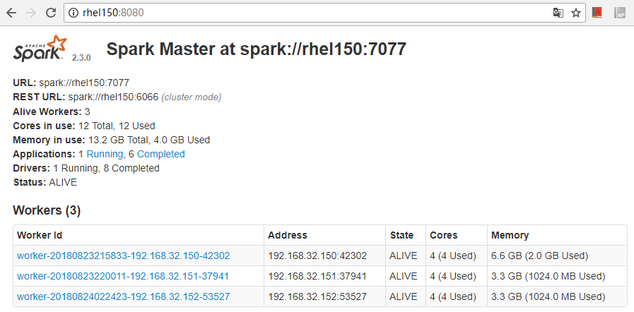

In this ARTS, i 

# 1.Algorithm
### Question: 


### My solution in python3 is:


# 2.Review
Today i read an artical titled “Moving from Python to Go” the link is: https://towardsdatascience.com/moving-to-go-from-python-9ebbd9a8aec4

In this artical, i studied some useful sentence or phrase, eg：
- What if： a user of this function would hopefully send you two integers that you can add. BUT, what if they send strings? Or dictionaries? 

# 3.Tips

# 4.Share(Spark 入门思考)

## 4.1 Spark基本概念
Spark官网的介绍中说明了Spark是一个快速和多用途的集群计算系统，其提供了Java、Scala、Python、R语言等的开发接口，使用这些语言进行Spark应用的开发都是很容易的，Spark屏蔽了底层任务之间的通信和同步等问题。而且还包括了Spark SQL用于处理SQL和结构化数据处理、MLlib模块用于机器学习，GraphX用于图形处理以及Spark流计算等。

Spark以下属于应该掌握：
Master：作为整个计算集群的管理端，作为提交任务的接口，可通过web连接Master进行系统信息查看(包括整个集群的计算节点、执行任务等)

Worker：计算节点，就是执行计算任务的主机

executor:spark任务的执行单元
driver program：任务的驱动程序，可简单理解为比如我们使用Java语言开发任务时的main类，其主要驱动任务在集群内并行执行。

application:就是具体的任务(数据处理业务逻辑)

RDD(resilient distributed dataset):可理解为我们要处理的数据集，可以从各种文件系统中创建，日常编程中很大的工作量就是处理RDD。

spark整体的执行逻辑就是由driver向master申请执行，master给worker分配资源，有worker调度executor执行任务，最终由driver汇总处理。

集群管理器(cluster manager):spark集群模式有Standalone(spark自身集群管理框架)、Mesos、Hadoop YARN、Kubernetes四种。后面三种需要单独安装然后配置spark，第一种则只需安装spark自身即可。

高可用：Spark可以借助于ZooKeeper进行master高可用性配置，保证Master有Standby Master，不出现单实例故障导致整个管理工作搁浅。

## 4.2 Spark集群搭建

### 4.2.1 测试环境准备
在192.168.32.150~152三台主机部署spark集群，基于spark2.3.1进行演示说明，编写任务的语言采用Java。这里我们使用Spark自带的Standalone集群管理器、不配置master的standby、也不使用hadoop进行文件存储，后边要演示的实例全部是操作worker主机的本地目录和文件。部署结构如下所示：

```
--master(同时也作为worker节点)
  192.168.32.150
--slave(worker节点)
  192.168.32.150
  192.168.32.151
  192.168.32.152
```
前置条件：在安装和配置之前需要保证所有机器JDK8+

### 4.2.2 Spark集群搭建及启动
- 安装配置之前先配置用户的免密登录(这里我使用的root用户，实际环境中是不建议使用root用户的)
- 下载：http://spark.apache.org/downloads.html,
- 解压spark: 在每台机器都进行解压到统一目录，比如这里我们解压到/root/spark目录，最终spark home目录为/root/spark/spark-2.3.0-bin-hadoop2.7
- spark配置：
1. spark-env.sh文件中配置JAVA_HOME,比如JAVA_HOME=/usr/java/jdk1.8.0_77
2. conf/slaves文件中配置所有需要启动worker的主机名或者ip地址，如：
```
rhel150
rhel151
rhel152
```
- spark集群启动：直接运行sbin/start-all.sh便可完成master和slave(worker)的启动。
启动完成后通过浏览器访问master的8080端口就能看到整个集群的全貌，包括所有的worker节点信息，如下图所示：



### 4.2 Spark 任务编程实现和部署

#### 4.2.1 样例概览
如下代码主要实现从指定文件中查找指定的关键字，答应出行数。

如下代码是初始化SparkContext。
```
SparkConf conf = new SparkConf().setAppName(appName);
JavaSparkContext sparkContext = new JavaSparkContext(conf);
```
如下代码为执行的核心逻辑，其中有大量调试内容主要是为了区分文件，这里我们的逻辑是发现文件又被修改后重新进行一次统计。特别说明一下我们读取的文件为worker主机上的本地文件，因此后边执行的时候需要拷贝测试文件到三台主机的相同目录。为了区分，我们把测试文件的第一行包含了当前主机名称，然后其他内容为包含SEVERE关键字的行。
```
while ((System.currentTimeMillis() - startTime) < sleepTime) {
			if (logFile.lastModified() > fileLastModified) {
				System.out.println("###############file[" + logFile + " Has been changed, we will count again. Now is:" + dateFormat.format(new Date()));
				JavaRDD<String> logData = sparkContext.textFile(logFilePath);
				System.out.println("###############file[" + logFile + "'s first line is:[" + logData.first() + "]");
				System.out.println("###############Spark Application is executed at machine[" + System.getenv("HOSTNAME") + "]");
				long numAs = logData.filter(s -> s.contains(key)).count();
				System.out.println("###############Lines with " + key + ": " + numAs);
				fileLastModified = logFile.lastModified();
			}
```
整个驱动类代码如下：
```

/* SimpleApp.java */
import java.io.File;
import java.text.SimpleDateFormat;
import java.util.Date;

import org.apache.spark.SparkConf;
import org.apache.spark.api.java.JavaRDD;
import org.apache.spark.api.java.JavaSparkContext;

public class SimpleRDDApp {
	/*args[0]: appName
	* args[1]: logFilePath
	* args[2]: key, the key for finding from file
	* args[3]: sleep, this task execute time.
	*/
	private static int ARG_COUNT = 3;
	private static SimpleDateFormat dateFormat = new SimpleDateFormat("yyyy-MM-dd'T'HH:mm:ss.SSSZ");
	public static void main(String[] args) {
		
		if(args.length < ARG_COUNT){
			System.exit(255);
		}
		
		String appName = args[0];
		String logFilePath = args[1];
		String key = args[2];
		
		// sleep time(unit:second)
		int sleepTime = 60000;
		if(args.length > 3){
			sleepTime = Integer.parseInt(args[3])*1000;
		}
		
		SparkConf conf = new SparkConf().setAppName(appName);
		JavaSparkContext sparkContext = new JavaSparkContext(conf);
		
		long startTime = System.currentTimeMillis();
		File logFile = new File(logFilePath);
		long fileLastModified = 0;
		while ((System.currentTimeMillis() - startTime) < sleepTime) {
			if (logFile.lastModified() > fileLastModified) {
				System.out.println("###############file[" + logFile + " Has been changed, we will count again. Now is:" + dateFormat.format(new Date()));
				JavaRDD<String> logData = sparkContext.textFile(logFilePath);
				System.out.println("###############file[" + logFile + "'s first line is:[" + logData.first() + "]");
				System.out.println("###############Spark Application is executed at machine[" + System.getenv("HOSTNAME") + "]");
				long numAs = logData.filter(s -> s.contains(key)).count();
				System.out.println("###############Lines with " + key + ": " + numAs);
				fileLastModified = logFile.lastModified();
			}

			try {
				Thread.sleep(1000);
			} catch (InterruptedException e) {
				e.printStackTrace();
			}
		}
		
		sparkContext.close();
		sparkContext.stop();
	}
}
```

#### 4.2.2 任务打包和运行
可以采用任何一种你喜欢的工具把以上类打包成jar文件。
然后把打包后的jar传到三台主机的相同目录，比如本例中传到三台主机的/root/spark/apps目录，然后每台主机的/root/spark/testfile.log为测试文件，内容如下所示：

其中第一行内容在各主机上有差别，分别我自身的主机名：
```
This file is in rhel150
####|2018-08-22 21:51:52.782|SEVERE|javax.enterprise.system.std.logging|_ThreadID=499;_ThreadName=pool-1-app-11;|java.lang.IllegalArgumentException: 数据库连接名不能为空!
####|2018-08-23 08:28:31.841|SEVERE|javax.enterprise.system.std
```
采用如下脚本命令提交Spark任务

```
#!/bin/bash

/root/spark/spark-2.3.0-bin-hadoop2.7/bin/spark-submit --class SimpleRDDApp --master spark://192.168.32.150:7077 --deploy-mode cluster /root/spark/apps/spark-0.0.1-SNAPSHOT.jar SimpleRDDApp /root/spark/testfile.log SEVERE 6000000
```
#### 4.2.3 查看执行结果
任务提交成功后，可以通过管理界面查看到任务被分配到哪一台主机上执行，类似如下图所示：


如上图所示，我们可以看到我们的driver程序(driver-20180824210025-0008)最终被分配到150主机上运行，然后我们在150主机上修改/root/spark/testfile.log，触发重新count操作。

通过对/root/spark/spark-2.3.0-bin-hadoop2.7/work/driver-20180824210025-0008/stdout文件的检查，看到任务执行成功。
而且我们通过关键字检索看到日志中每一次重算对应的文件是会有区别的，有时候RDD内容对应150主机上的文件，有时候对应151和152主机上的文件。这说明每次任务的执行是在集群中动态调度的，所以会看到输出的count不断变化。

```
[root@rhel150 driver-20180824210025-0008]# cat stdout | grep "######"
###############file[/root/spark/testfile.log Has been changed, we will count again. Now is:2018-08-24T21:00:28.059+0800
###############file[/root/spark/testfile.log's first line is:[This file is in rhel150]
###############Spark Application is executed at machine[rhel150]
###############Lines with SEVERE: 94
###############file[/root/spark/testfile.log Has been changed, we will count again. Now is:2018-08-24T21:03:11.291+0800
###############file[/root/spark/testfile.log's first line is:[This file is in rhel150]
###############Spark Application is executed at machine[rhel150]
###############Lines with SEVERE: 95
###############file[/root/spark/testfile.log Has been changed, we will count again. Now is:2018-08-24T21:03:40.236+0800
###############file[/root/spark/testfile.log's first line is:[This file is in rhel152]
###############Spark Application is executed at machine[rhel150]
###############Lines with SEVERE: 100
###############file[/root/spark/testfile.log Has been changed, we will count again. Now is:2018-08-24T21:05:02.505+0800
###############file[/root/spark/testfile.log's first line is:[This file is in rhel152]
###############Spark Application is executed at machine[rhel150]
###############Lines with SEVERE: 93
###############file[/root/spark/testfile.log Has been changed, we will count again. Now is:2018-08-24T21:05:27.955+0800
###############file[/root/spark/testfile.log's first line is:[This file is in rhel151]
###############Spark Application is executed at machine[rhel150]
###############Lines with SEVERE: 93
###############file[/root/spark/testfile.log Has been changed, we will count again. Now is:2018-08-24T21:05:34.241+0800
###############file[/root/spark/testfile.log's first line is:[This file is in rhel151]
###############Spark Application is executed at machine[rhel150]
###############Lines with SEVERE: 93
###############file[/root/spark/testfile.log Has been changed, we will count again. Now is:2018-08-24T21:06:58.788+0800
###############file[/root/spark/testfile.log's first line is:[This file is in rhel152]
###############Spark Application is executed at machine[rhel150]
###############Lines with SEVERE: 93
###############file[/root/spark/testfile.log Has been changed, we will count again. Now is:2018-08-24T21:07:04.960+0800
###############file[/root/spark/testfile.log's first line is:[This file is in rhel150]
###############Spark Application is executed at machine[rhel150]
###############Lines with SEVERE: 106
```


## 4.3 关于Spark的几点思考
1. 采用ZooKeeper实现Spark的master高可用方案在生产环境是推荐的
2. 在生产环境中一般从HDFS或者HBase、HIVE等分布式存储中获取数据源进行分析处理
3. 随着Kerbernetes本身的流行采用Kubernetes作为集群调度工具应该是趋势
4. Spark2.0中使用Dataset取代了RDD，RDD变成API目前不是很推荐使用了。还有Spark流处理是Storm本身的区别是什么有待于后边继续研究。
5. 上一篇ARTS中提到的Storm与Spark的区别，各自的适用场景有待深入研究。

