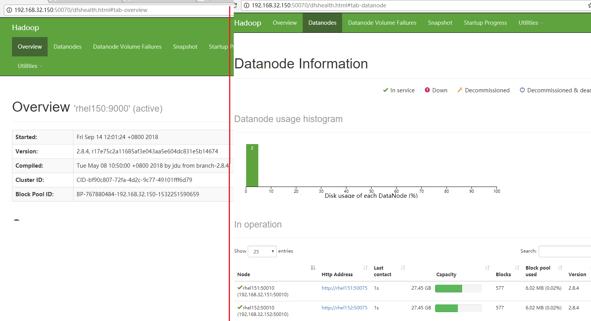
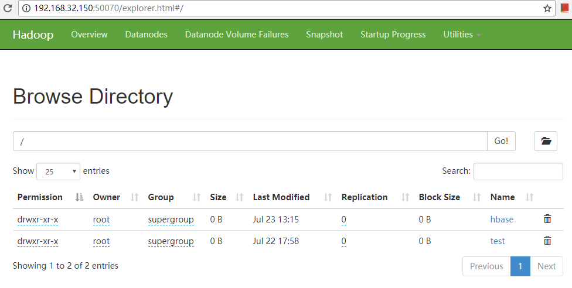

In this ARTS, I introduces the Spark's installation,configration and program sample.

# 1.Algorithm
### Question: 


### My solution in python3 is:


# 2.Review
// TODO: I will complete it later.

# 3.Tips


# 4.Share(Hadoop HDFS 入门思考)

## 4.1 Hadoop基本概念
### 4.1.1 HDFS
  ***Hadoop提供的分布式文件系统，HDFS集群由NameNode和DataNode组成，NameNode对应的主机会有一个master server负责管理文件系统命名空间，DataNode则完成最终文件的存储。
  ***HDFS每个文件都会被分块存储，也就是Block，块大小是可以设置的。为了提高文件系统可靠性，HDFS的文件块会在多台机器上保存，块复制数(replicas)是可以配置的。
### 4.1.2 MapReduce
 为了并行处理大量数据的一个集群框架。
 MapReduce Job把输入的数据分为多个chunk，然后由Reduce Task进行数据处理。
 MapReduce集群由一个Resource Manager（集群管理主机上）和多个NodeManager（集群业务主机上）组成
### 4.1.3 Yarn
  Yarn作为新一代的MapReduce框架，核心思想是把资源管理（Resouce Manager）和任务调度监控（Job Scheduling/monitoring）分开，由不同的Daemon进程完成。
  Yarn中也分ResourceManager和NodeManager，其中Resource Manager有Scheduler和ApplicationManager两个组件，Scheduler主要负责分分配资源给应用，并不会进行应用的状态监控，ApplicationManager接受任务提交，并协商让第一个运行任务的容器运行ApplicationMaster，ApplicationMaster负责任务状态的跟踪。
  
  如下为Yarn的架构图:
  
本文主要讲HDFS的使用

## 4.2 Hadoop集群搭建

### 4.2.1 测试环境准备
在192.168.32.150~152三台主机部署Hadoop集群，部署结构如下所示：

```
--namenode
  192.168.32.150
--datanode
  192.168.32.151
  192.168.32.152
```
前置条件：
1. 在安装和配置之前需要保证所有机器JDK8+
2. 各主机之间配置SSH免密登录

### 4.2.2 Hadoop集群搭建及启动
- 安装配置之前先配置用户的免密登录(这里我使用的root用户，实际环境中是不建议使用root用户的)
- 下载：https://hadoop.apache.org/releases.html,
- 解压hadoop: 在每台机器都进行解压到统一目录，比如这里我们解压到/root/hadoop目录，最终hadoop home目录为/root/hadoop/hadoop-2.8.4
- hadoop配置(全部在master主机，也就是我们的namenode、resource manager主机上进行)：
1. etc/hadoop/hadoop-env.sh文件中配置JAVA_HOME,比如"export JAVA_HOME=/usr/java/jdk1.8.0_77"
2. etc/hadoop/core-site.xml文件中配置FS的namenode URI等，如：
```
<configuration>
<property>
   <name>hadoop.tmp.dir</name>
        <value>/root/hadoop/tmp</value>
        <description>Abase for other temporary directories.</description>
   </property>
   <property>
        <name>fs.defaultFS</name>
        <value>hdfs://rhel150:9000</value>
   </property>
</configuration>
```
这里fs.defaultFS即为namenode的URI，在早期版本中属性名为fs.default.name

3. etc/hadoop/hdfs-site.xml文件中配置HDFS的复制数、目录等，如：
```
<configuration>

<property>
   <name>dfs.name.dir</name>
   <value>/root/hadoop/dfs/name</value>
   <description>Path on the local filesystem where theNameNode stores the namespace and transactions logs persistently.</description>
</property>
<property>
   <name>dfs.data.dir</name>
   <value>/root/hadoop/dfs/data</value>
   <description>Comma separated list of paths on the localfilesystem of a DataNode where it should store its blocks.</description>
</property>
<property>
   <name>dfs.replication</name>
   <value>2</value>
</property>
<property>
      <name>dfs.permissions</name>
      <value>false</value>
      <description>need not permissions</description>
</property>

</configuration>
```

4.etc/hadoop/yarn-site.xml主要配置Resource Manager的信息，如：
```
<configuration>

<!-- Site specific YARN configuration properties -->

<property>
        <name>yarn.resourcemanager.hostname</name>
        <value>rhel150</value>
   </property>
   <property>
        <description>The address of the applications manager interface in the RM.</description>
        <name>yarn.resourcemanager.address</name>
        <value>${yarn.resourcemanager.hostname}:8032</value>
   </property>
   <property>
        <description>The address of the scheduler interface.</description>
        <name>yarn.resourcemanager.scheduler.address</name>
        <value>${yarn.resourcemanager.hostname}:8030</value>
   </property>
   <property>
        <description>The http address of the RM web application.</description>
        <name>yarn.resourcemanager.webapp.address</name>
        <value>${yarn.resourcemanager.hostname}:8088</value>
   </property>
   <property>
        <description>The https adddress of the RM web application.</description>
        <name>yarn.resourcemanager.webapp.https.address</name>
        <value>${yarn.resourcemanager.hostname}:8090</value>
   </property>
   <property>
        <name>yarn.resourcemanager.resource-tracker.address</name>
        <value>${yarn.resourcemanager.hostname}:8031</value>
   </property>
   <property>
        <description>The address of the RM admin interface.</description>
        <name>yarn.resourcemanager.admin.address</name>
        <value>${yarn.resourcemanager.hostname}:8033</value>
   </property>
   <property>
        <name>yarn.nodemanager.aux-services</name>
        <value>mapreduce_shuffle</value>
   </property>
   <property>
        <name>yarn.scheduler.maximum-allocation-mb</name>
        <value>1024</value>
        <discription>每个节点可用内存,单位MB,默认8182MB</discription>
   </property>
   <property>
        <name>yarn.nodemanager.vmem-pmem-ratio</name>
        <value>2.1</value>
   </property>
   <property>
        <name>yarn.nodemanager.resource.memory-mb</name>
        <value>1024</value>
</property>
   <property>
        <name>yarn.nodemanager.vmem-check-enabled</name>
        <value>false</value>
</property>

</configuration>
```
5.etc/hadoop/mapred-site.xml主要配置类如mapreduce引擎之类的信息，如下所示配置了新的资源调度框架yarn作为mapreduce的引擎：
```
<configuration>

 <property>
    <name>mapred.job.tracker</name>
    <value>rhel150:49001</value>
</property>
<property>
      <name>mapred.local.dir</name>
       <value>/root/hadoop/var</value>
</property>
<property>
       <name>mapreduce.framework.name</name>
       <value>yarn</value>
</property>

</configuration>
```
6. etc/hadoop/slaves文件则配置了另外两台主机作为slave机器
```
rhel151
rhel152
```

- hadoop集群启动：
1. 在namenode机器(192.168.32.150)的/root/hadoop/hadoop-2.8.4/bin目录下执行初始化脚本，也就是执行命令：
 ./hadoop  namenode  -format

2.直接运行/root/hadoop/hadoop-2.8.4/sbin/start-all.sh便可完成master和slave(datanode)的启动。
启动完成后通过浏览器访问master的50070端口就能看到整个集群的全貌，包括所有的datanode节点信息，如下图所示：




### 4.2 Hadoop HDFS基本操作
启动hadoop后，便可以使用hadoop的fs模块进行文件操作。
***创建HDFS文件夹 ./hadoop fs -mkdir /test

***列HDFS文件：
[root@rhel150 bin]# ./hadoop fs -fs hdfs://rhel150:9000 -ls /
Found 1 items
drwxr-xr-x   - root supergroup          0 2018-07-22 17:55 /test

***拷贝本地文件到HDFS
./hadoop fs -fs hdfs://rhel150:9000 -copyFromLocal /root/hadoop/hadoop-2.8.4/etc/hadoop/core-site.xml /test/core-site.xml

新建的文件夹和文件，可以在浏览器上查看到文件目录结构


## 4.3 关于Hadoop的几点思考
1. 采用ZooKeeper实现Spark的master高可用方案在生产环境是推荐的
2. 在生产环境中一般从HDFS或者HBase、HIVE等分布式存储中获取数据源进行分析处理
3. 随着Kerbernetes本身的流行采用Kubernetes作为集群调度工具应该是趋势
4. Spark2.0中使用Dataset取代了RDD，RDD变成API目前不是很推荐使用了。还有Spark流处理是Storm本身的区别是什么有待于后边继续研究。
5. 上一篇ARTS中提到的Storm与Spark的区别，各自的适用场景有待深入研究。

