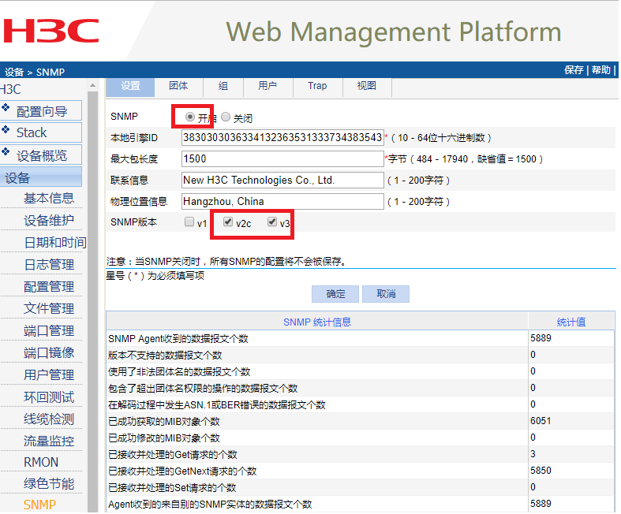
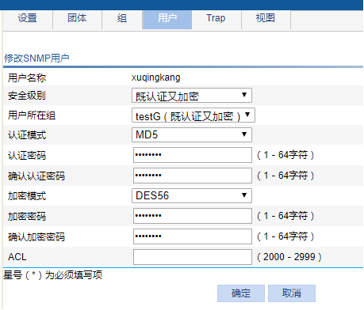

In this ARTS, I introduces the SNMP's configration and program sample.

# 1.Algorithm
### Question: 


### My solution in python3 is:


# 2.Review
// TODO: I will complete it later.

# 3.Tips


# 4.Share(SNMP相关实战)

## 4.1 记忆中的SNMP
2013年的时候，因为中间件投标，在很多招标文件里边要求中间件支持SNMP协议的管理和监控，所以当时跟同事一起开发了中间件的SNMP模块。做到可以通过SNMP监控中间件的线程池、资源池、WEB请求统计（比如200、400、404等相应对应的比例统计）等，也可以设置一些阈值，当指标超过阈值时通过SNMP TRAP发送信息到NMS(网管系统)。

当时初次接触SNMP,对SNMP PDU、OID、MIB、Community、Agent等各种名词均需要恶补。而在中间件的角度，中间件实例是一个个的Agent，需要接收NMS系统对中间件的指标监控，如查看内存使用情况，线程池使用情况等。NMS向中间件发起SNMP GET信息，然后使用我们定义的OID获取对应的信息。

如下所示：我们给自己的产品定义了一个oid的root节点，为1.3.6.1.4.1.218，然后公司多个产品，把中间件appserver产品则定义在218下面的321节点，之后jvmRuntimeTable就是关于JVM内存使用的OID信息。这个文件比较简单，基本能理解其作为MIB文件就是定义OID与监控项的关系。然后中间件的进程中，当接收到不同的OID时需要从监控项中返回对应的值。

```
--  GENERATED MIB FILE  --
BES-MIB DEFINITIONS ::=
BEGIN
  IMPORTS
    DisplayString FROM RFC1213-MIB
    OBJECT-TYPE, MODULE-IDENTITY,Counter64, NOTIFICATION-TYPE
      FROM SNMPV2-SMI;
      
  appserver       MODULE-IDENTITY
    LAST-UPDATED  "Fri Mar 08 11:24:31 CST 2013"
    ORGANIZATION  "BES Software Corporation"
    CONTACT-INFO  "www.bessystem.com"
    DESCRIPTION   "BES"
    ::=           {bes 321}

  bes       OBJECT IDENTIFIER ::= { iso 3 6 1 4 1 218 }

  appserver       OBJECT IDENTIFIER ::= { bes 321 }
  
  jvmRuntimeTable       OBJECT-TYPE
      SYNTAX          SEQUENCE OF JVMRuntimeEntryType
      MAX-ACCESS      not-accessible
      STATUS          current
      DESCRIPTION     "This table contains runtime information about java virtual machine(JVM)"
      ::=             { appserver 2 }

  jvmRuntimeEntry       OBJECT-TYPE
      SYNTAX          JVMRuntimeEntryType
      MAX-ACCESS      not-accessible
      STATUS          current
      DESCRIPTION     "Entry of jvmRuntimeTable"
      INDEX           { jvmRuntimeHeapsizeCurrent }
      ::=             { jvmRuntimeTable 1 }

  JVMRuntimeEntryType ::=
      SEQUENCE {
          jvmRuntimeHeapsizeCurrent  Counter64,
          jvmRuntimeHeapsizeHighWatermark  Counter64,
          jvmRuntimeHeapsizeLowWatermark  Counter64,
          jvmRuntimeHeapsizeUnit  OctetString,
          jvmRuntimeHeapsizeLowerBound  Counter64,
          jvmRuntimeHeapsizeUpperBound  Counter64,
      }

  jvmRuntimeHeapsizeCurrent       OBJECT-TYPE
      SYNTAX          Counter64
      MAX-ACCESS      read-only
      STATUS          current
      DESCRIPTION     "The current JVM heap size"
      ::=             { jvmRuntimeEntry 2 }
```

## 4.2 现在回顾下SNMP
当年因为对MIB和OID的一些误解，我们在1.3.6.1.4.1下起了一个218节点就作为公司的SNMP OID根节点了，最近有需求我们需要作为NMS从各种网络设备中通过SNMP获取信息，才知道正确的定义自己公司的SNMP OID根节点的姿势是发邮件到iana-mib@isi.edu进行申请。

### 4.2.1 NMS代码模拟
如果需要模拟NMS系统发起SNMP GET请求，可以使用SNMP4J开源组建进行。在这里测试的话需要根据不同的网络设备在配置，以下以H3C S2610交换机为例。

1,开始交换机的SNMP模块，如下图所示:



2、需要注意支持SNMPV3时需要定义好用户信息，SNMPV3增强访问安全性也是一大特性：
SNMPV3中的认证和加密都是可选项。



3、我们使用如下的snmpwalk命令既可以获取交换机信息：
snmpwalk -v 3 -u xuqingkang -l authPriv -a MD5 -A xuqingkang -x DES -X xuqingkang 192.168.0.234
其中-A是认证密码，-X是加密密码，-u是用户名。

4、MIB信息(也就是OID对应交换机的什么属性)需要咨询设备厂商售后获取


