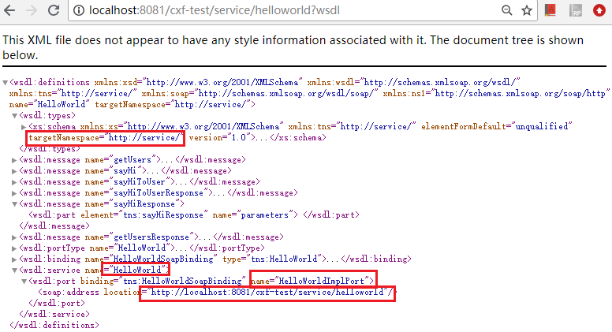

# ***Apache CXF入门
  Apache CXF是一种Web Service服务和客户端的实现，其可以和Spring配合快速构建WebService，还有 它调用WebService的客户端api也是比较简单的，今天我们来看怎么实现一个简单的Web Service服务并调用他。
  
  ## 1，服务端开发
    我们的例子来自于官网：http://cxf.apache.org/docs/a-simple-jax-ws-service.html
    我们把官网的HelloWorld例子改为通过Spring结合注册成WebService
  ### 1.1 Service接口和实现
  我们实现了如下的Service接口，其中sayHi是传递字符串，sayHiToUser是需要传递一个User(接口，有专门的XmlAdapter处理序列化/marshal),getUsers是从服务器端获取用户列表，这里也演示了Web Service对Map对象的marshal操作。
```
package service;

import java.util.Map;

import javax.jws.WebService;
import javax.xml.bind.annotation.adapters.XmlJavaTypeAdapter;

@WebService
public interface HelloWorld {
 
    String sayHi(String text);
 
    /* 
     * 传递接口的WebService示例，JAXB不能直接传递接口，需要专门的XmlAdapter来处理消息传递。
     */
    String sayHiToUser(User user);
 
    /* 
     * JAXB也不支持Map，需要通过XmlAdapter把Map映射为Beans。
     */
    @XmlJavaTypeAdapter(IntegerUserMapAdapter.class)
    Map<Integer, User> getUsers();
} 

```
  Service的实现是非常简单的。
  
```
package service;
import java.util.LinkedHashMap;
import java.util.Map;

import javax.jws.WebService;

@WebService(endpointInterface = "service.HelloWorld",
            serviceName = "HelloWorld")
public class HelloWorldImpl implements HelloWorld {
    Map<Integer, User> users = new LinkedHashMap<Integer, User>();


    public String sayHi(String text) {
        System.out.println("sayHi called");
        return "Hello " + text;
    }

    public String sayHiToUser(User user) {
        System.out.println("sayHiToUser called");
        users.put(users.size() + 1, user);
        return "Hello "  + user.getName();
    }

    public Map<Integer, User> getUsers() {
        System.out.println("getUsers called");
        return users;
    }

}
```

### 1.2 对象的序列化:marshal/unmashal
  我们的Service接口和实现都是很简单的，但其实后边需要定义很多类完成序列化，在Web Service中叫做marshal和unmashal操作的XmlAdapter。
  
  为了User和User Map需要有如下几个支撑类
  
==User==：
```
package service;
import javax.xml.bind.annotation.adapters.XmlJavaTypeAdapter;

@XmlJavaTypeAdapter(UserAdapter.class)
public interface User {

    String getName();
}
```
==UserImpl==：

```
package service;
import javax.xml.bind.annotation.XmlType;


@XmlType(name = "User")
public class UserImpl implements User {
    String name;

    public UserImpl() {
    }
    public UserImpl(String s) {
        name = s;
    }

    public String getName() {
        return name;
    }

    public void setName(String s) {
        name = s;
    }
}
```
==UserAdapter==：

```
package service;
import javax.xml.bind.annotation.adapters.XmlAdapter;

public class UserAdapter extends XmlAdapter<UserImpl, User> {
    public UserImpl marshal(User v) throws Exception {
        if (v instanceof UserImpl) {
            return (UserImpl)v;
        }
        return new UserImpl(v.getName());
    }

    public User unmarshal(UserImpl v) throws Exception {
        return v;
    }
}
```

==IntegerUserMap==：该类的功能是通过List方式保存User列表
```
package service;
import javax.xml.bind.annotation.XmlAccessType;
import javax.xml.bind.annotation.XmlAccessorType;
import javax.xml.bind.annotation.XmlElement;
import javax.xml.bind.annotation.XmlType;


@XmlType(name = "IntegerUserMap")
@XmlAccessorType(XmlAccessType.FIELD)
public class IntegerUserMap {
    @XmlElement(nillable = false, name = "entry")
    List<IntegerUserEntry> entries = new ArrayList<IntegerUserEntry>();

    public List<IntegerUserEntry> getEntries() {
        return entries;
    }

    @XmlAccessorType(XmlAccessType.FIELD)
    @XmlType(name = "IdentifiedUser")
    static class IntegerUserEntry {
        //Map keys cannot be null
        @XmlElement(required = true, nillable = false)
        Integer id;

        User user;

        public void setId(Integer k) {
            id = k;
        }
        public Integer getId() {
            return id;
        }

        public void setUser(User u) {
            user = u;
        }
        public User getUser() {
            return user;
        }
    }
}
```
==IntegerUserMapAdapter==：这个类则是完成User Map转换成Bean，其实最后的Bean就是上边保存User列表的==IntegerUserMap==
```
package service;
import java.util.LinkedHashMap;
import java.util.Map;

import javax.xml.bind.annotation.adapters.XmlAdapter;

public class IntegerUserMapAdapter extends XmlAdapter<IntegerUserMap, Map<Integer, User>> {
    public IntegerUserMap marshal(Map<Integer, User> v) throws Exception {
        IntegerUserMap map = new IntegerUserMap();
        for (Map.Entry<Integer, User> e : v.entrySet()) {
            IntegerUserMap.IntegerUserEntry iue = new IntegerUserMap.IntegerUserEntry();
            iue.setUser(e.getValue());
            iue.setId(e.getKey());
            map.getEntries().add(iue);
        }
        return map;
    }

    public Map<Integer, User> unmarshal(IntegerUserMap v) throws Exception {
        Map<Integer, User> map = new LinkedHashMap<Integer, User>();
        for (IntegerUserMap.IntegerUserEntry e : v.getEntries()) {
            map.put(e.getId(), e.getUser());
        }
        return map;
    }

}
```
  ### 1.3 应用web.xml
  应用的web.xml需要定义Spring和CXFServlet配置，其中应用上下文后跟上"/service"的请求都将被CXFServlet处理。
  Spring注册Web Service的配置文件为：==/WEB-INF/config/cxf-servlet.xml==
```
  <!-- 加载spring配置文件 -->
    <context-param>
        <param-name>contextConfigLocation</param-name>
        <param-value>/WEB-INF/config/cxf-servlet.xml</param-value>
    </context-param>
    <listener>
        <listener-class>org.springframework.web.context.ContextLoaderListener</listener-class>
    </listener>
    <!-- 注册CXF servlet -->
    <servlet>
        <servlet-name>CXFServlet</servlet-name>
        <servlet-class>org.apache.cxf.transport.servlet.CXFServlet</servlet-class>
        <load-on-startup>1</load-on-startup>
    </servlet>
    <servlet-mapping>
        <servlet-name>CXFServlet</servlet-name>
        <url-pattern>/service/*</url-pattern>
    </servlet-mapping>
    <!-- CXF END -->
```

如下，我们在==cxf-servlet.xml==中定义了一个Bean(也就是service.HelloWorldImpl)，然后通过引用的方式把这个类注册为Web Service
```
<?xml version="1.0" encoding="UTF-8"?>
<beans xmlns="http://www.springframework.org/schema/beans"
    xmlns:xsi="http://www.w3.org/2001/XMLSchema-instance"
    xmlns:jaxws="http://cxf.apache.org/jaxws" 
    xsi:schemaLocation="http://www.springframework.org/schema/beans 
    http://www.springframework.org/schema/beans/spring-beans.xsd
    http://cxf.apache.org/jaxws 
    http://cxf.apache.org/schemas/jaxws.xsd">

    <import resource="classpath:META-INF/cxf/cxf.xml"/>
    <import resource="classpath:META-INF/cxf/cxf-servlet.xml"/>
    <bean id="helloWorld" class="service.HelloWorldImpl"/>
    <jaxws:endpoint id="hello" 
    implementor="#helloWorld"
    address="/helloworld"/>

</beans>
```
  ## 2，服务部署及WSDL验证
  ### 2.1 部署
  如上的类完成，最终打包到war文件中可直接部署于Tomcat，比如本例中tomcat端口为8081，应用包为cxf-test.war。部署于tomcat后，请求地址则为http://localhost:8081/cxf-test
  
  ### 2.2 服务验证
  当部署成功服务之后，我们通过浏览器访问地址：http://localhost:8081/cxf-test/service/helloworld?wsdl
  可以看到如下Web Service的WSDL描述，我用红色框框框出了重要信息，这些信息在我们使用客户端调用这个Web Service的时候是非常重要的，比如名称空间、服务端口名、服务名、服务地址等

  
  
 ## 3，客户端实现
 ### 3.1 核心代码示例

  如果需要最简单话实现一个客户端的话，就只需要下面的代码。注意设置正确url，namespace，服务名称，服务端口名称等。如下为最关键的引用类和实现代码：
    
```
import javax.xml.namespace.QName;

import org.apache.cxf.endpoint.Client;
import org.apache.cxf.frontend.ClientProxy;
import org.apache.cxf.jaxb.JAXBDataBinding;
import org.apache.cxf.jaxws.JaxWsProxyFactoryBean;
import org.apache.cxf.transport.http.HTTPConduit;
import org.apache.cxf.transports.http.configuration.HTTPClientPolicy;

String serviceURL = "http://localhost:8081/cxf-test/service/helloworld?wsdl";
String namespace = "http://service/"；
String serviceName = "HelloWorld";
String servicePortName = "HelloWorldImplPort";

javax.xml.ws.Service service = javax.xml.ws.Service.create(new URL(serviceURL), new QName(namespace, serviceName));
proxy = service.getPort(new QName(namespace, servicePortName), service.HelloWorld.class);
HelloWorld hw = (HelloWorld)proxy;
hw.sayHi("ApacheCXF");
```
特别说明一下，url后边需要跟上"?wsdl" 否则你可能遇到这样的错误：
```
Caused by: javax.wsdl.WSDLException: WSDLException (at /soap:Envelope): faultCode=INVALID_WSDL: Expected element '{http://schemas.xmlsoap.org/wsdl/}definitions'.
```

  ### 3.2 完整代码实现
  本例中，实验目的，我把服务端写成了一个Servlet部署于Service端所在的war包里边。
  如下WebAddress主要是Web服务的信息保存，其中定义了两种方式访问服务端。
```

public class WebAddress {
    private Long id;
    String url;
    private InvokeType invokeType;

    private Integer connectTimeout;
    private Integer receiveTimeout;
    private String serviceName;
    private String serviceNameSpace;
    private String portName;
    private String portNameSpace;

    public static enum InvokeType {
        DIRECTLY(1), WSDL(2), UNKOWN(-1);

        public static final String NAME = "WebAddress$InvokeType";
        private int value;

        private InvokeType(int value) {
            this.value = value;
        }

        public int getValue() {
            return this.value;
        }

        public static InvokeType get(int value) {
            InvokeType[] arrayOfInvokeType;
            int j = (arrayOfInvokeType = values()).length;
            for (int i = 0; i < j; i++) {
                InvokeType type = arrayOfInvokeType[i];
                if (type.value == value) {
                    return type;
                }
            }
            throw new IllegalArgumentException("argument error: " + value);
        }
    }

    public Long getId() {
        return this.id;
    }

    public void setId(Long id) {
        this.id = id;
    }

    public String getUrl() {
        return url;
    }

    public void setUrl(String url) {
        this.url = url;
    }

    public InvokeType getInvokeType() {
        return invokeType;
    }

    public void setInvokeType(InvokeType invokeType) {
        this.invokeType = invokeType;
    }

    public Integer getConnectTimeout() {
        return connectTimeout;
    }

    public void setConnectTimeout(Integer connectTimeout) {
        this.connectTimeout = connectTimeout;
    }

    public Integer getReceiveTimeout() {
        return receiveTimeout;
    }

    public void setReceiveTimeout(Integer receiveTimeout) {
        this.receiveTimeout = receiveTimeout;
    }

    public String getServiceName() {
        return serviceName;
    }

    public void setServiceName(String serviceName) {
        this.serviceName = serviceName;
    }

    public String getServiceNameSpace() {
        return serviceNameSpace;
    }

    public void setServiceNameSpace(String serviceNameSpace) {
        this.serviceNameSpace = serviceNameSpace;
    }

    public String getPortName() {
        return portName;
    }

    public void setPortName(String portName) {
        this.portName = portName;
    }

    public String getPortNameSpace() {
        return portNameSpace;
    }

    public void setPortNameSpace(String portNameSpace) {
        this.portNameSpace = portNameSpace;
    }

}

```

==Servlet==：如下为具体的实现，因为是客户端Servlet跟Web Service在一个war包，也就是一个应用中，所以端口和上下文都是共享的，所以
使用request获取本地地址、端口和上下文等信息。
```


import java.io.IOException;
import java.net.URL;
import java.util.Map;

import javax.servlet.ServletException;
import javax.servlet.http.HttpServlet;
import javax.servlet.http.HttpServletRequest;
import javax.servlet.http.HttpServletResponse;
import javax.xml.namespace.QName;

import org.apache.cxf.endpoint.Client;
import org.apache.cxf.frontend.ClientProxy;
import org.apache.cxf.jaxb.JAXBDataBinding;
import org.apache.cxf.jaxws.JaxWsProxyFactoryBean;
import org.apache.cxf.transport.http.HTTPConduit;
import org.apache.cxf.transports.http.configuration.HTTPClientPolicy;

import service.HelloWorld;
import service.UserImpl;

/**
 * Servlet implementation class TestCXFClinetServlet
 */
public class TestCXFClientServlet extends HttpServlet {
    private static final long serialVersionUID = 1L;

    /**
     * @see HttpServlet#HttpServlet()
     */
    public TestCXFClientServlet() {
        super();
        // TODO Auto-generated constructor stub
    }

    /**
     * @see HttpServlet#doGet(HttpServletRequest request, HttpServletResponse
     *      response)
     */
    protected void doGet(HttpServletRequest request, HttpServletResponse response)
            throws ServletException, IOException {
        String method = "sayHi";
        if(request.getParameter("method")!=null){
            method = request.getParameter("method");
        }
        response.getWriter().append("Served at: ").append(request.getContextPath());
        WebAddress webAddress = new WebAddress();
        webAddress.setInvokeType(WebAddress.InvokeType.UNKOWN);
        
        webAddress.setUrl("http://" + request.getLocalAddr() + ":" + request.getServerPort() + request.getContextPath() + "/service/helloworld?wsdl");
        String namespace = "http://service/";
        webAddress.setConnectTimeout(2);
        webAddress.setReceiveTimeout(3);
        webAddress.setServiceNameSpace(namespace);
        webAddress.setServiceName("HelloWorld");
        webAddress.setPortNameSpace(namespace);
        webAddress.setPortName("HelloWorldImplPort");
        try {
            HelloWorld hw = createProxy(webAddress, HelloWorld.class, null);
            response.getWriter().write("I'm ok!");
            if("sayHi".equals(method)){
                response.getWriter().write("Message come from server is:" + hw.sayHi("yyy"));
            }else if("sayHiToUser".equals(method)){
                response.getWriter().write("Message come from server is:" + hw.sayHiToUser(new UserImpl("u" + System.currentTimeMillis())));
            }else if("getUsers".equals(method)){
                response.getWriter().write("Message come from server is:" + hw.getUsers());
            }
            System.out.println("I'm ok!");
        } catch (Exception e) {
            printStackTraceToRes(response, e);
            Throwable ec = e.getCause();
            if (ec != null) {
                printStackTraceToRes(response, ec);

            }
            System.out.println(e.getMessage());
            e.printStackTrace();
        }

    }

    /**
     * @see HttpServlet#doPost(HttpServletRequest request, HttpServletResponse
     *      response)
     */
    protected void doPost(HttpServletRequest request, HttpServletResponse response)
            throws ServletException, IOException {
        // TODO Auto-generated method stub
        doGet(request, response);
    }

    public <T> T createProxy(WebAddress webAddress, Class<T> clazz, Map<String, String> namespace) throws Exception {
        T proxy;
        switch (webAddress.getInvokeType())
        {
        case DIRECTLY: 
          JaxWsProxyFactoryBean factory = new JaxWsProxyFactoryBean();
          factory.setServiceClass(clazz);
          factory.setAddress(webAddress.getUrl());
          proxy = (T) factory.create();
          
          break;
        case UNKOWN: 
          javax.xml.ws.Service service = javax.xml.ws.Service.create(new URL(webAddress.getUrl()), 
            new QName(webAddress.getServiceNameSpace(), webAddress.getServiceName()));
          proxy = service.getPort(new QName(webAddress.getPortNameSpace(), webAddress.getPortName()), clazz);
          
          break;
        default: 
          throw new Exception("unkown request type: " + webAddress.getInvokeType().name());
        }

        Client client = ClientProxy.getClient(proxy);
        configTimeout(client, webAddress);
        configNamespacePrefix(client, namespace);

        return proxy;
    }

    private static void configNamespacePrefix(Client client, Map<String, String> namespace) {
        org.apache.cxf.service.Service s = client.getEndpoint().getService();
        if (((s.getDataBinding() instanceof JAXBDataBinding)) && (namespace != null)) {
            ((JAXBDataBinding) s.getDataBinding()).setNamespaceMap(namespace);
        }
    }

    private static void configTimeout(Client client, WebAddress webAddress) {
        if (!webAddress.getUrl().startsWith("http")) {
            return;
        }
        HTTPConduit httpConduit = (HTTPConduit) client.getConduit();
        HTTPClientPolicy policy = httpConduit.getClient();
        policy.setConnectionTimeout(webAddress.getConnectTimeout().intValue() * 1000);
        policy.setReceiveTimeout(webAddress.getReceiveTimeout().intValue() * 1000);
    }

    private void printStackTraceToRes(HttpServletResponse response, Throwable e) {
        StackTraceElement[] elements = e.getStackTrace();
        if (elements == null) {
            return;
        }
        for (StackTraceElement element : elements) {
            try {
                response.getWriter().write(element.getClassName() + "." + element.getMethodName() + "("
                        + element.getFileName() + ":" + element.getLineNumber() + ")<br>");
            } catch (Exception aa) {
                aa.printStackTrace();
            }
        }
    }
}

```
访问以上Servlet(http://192.168.32.1:8081/cxf-test/test)，正常情况会在浏览器看到如下信息：
```
Served at: /cxf-testI'm ok!Message come from server is:Hello yyy
```
如下先多次执行：http://192.168.32.1:8081/cxf-test/test?method=sayHiToUser 会往用户列表中增加名称带系统时间的用户。

如果执行：http://192.168.32.1:8081/cxf-test/test?method=getUsers 
则会看到类似如下的信息


